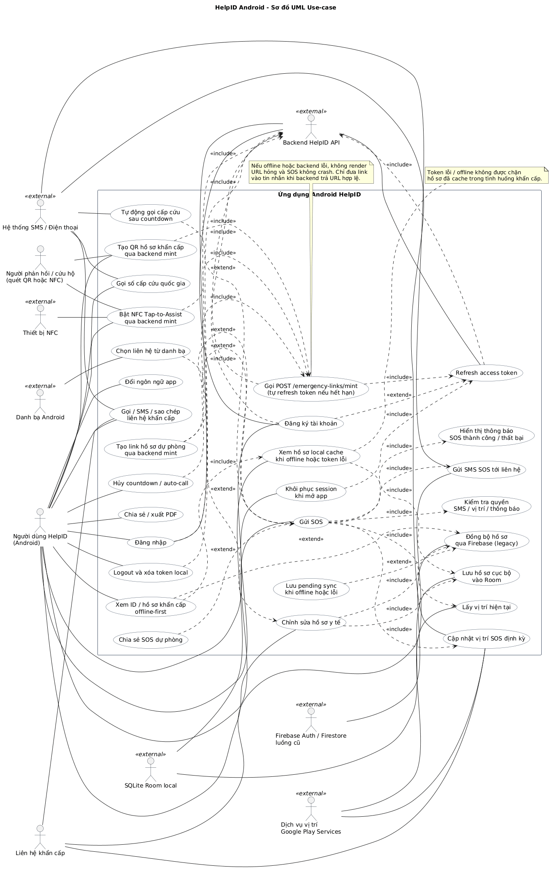
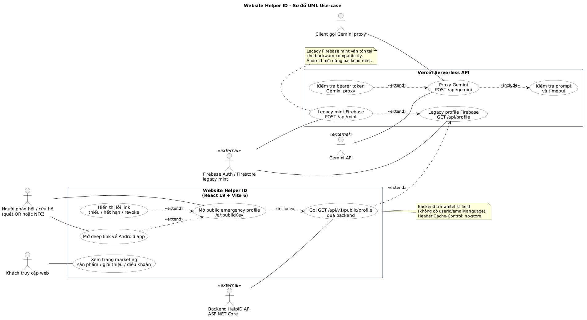
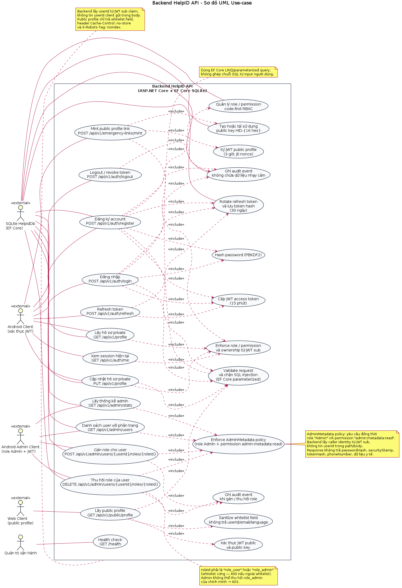
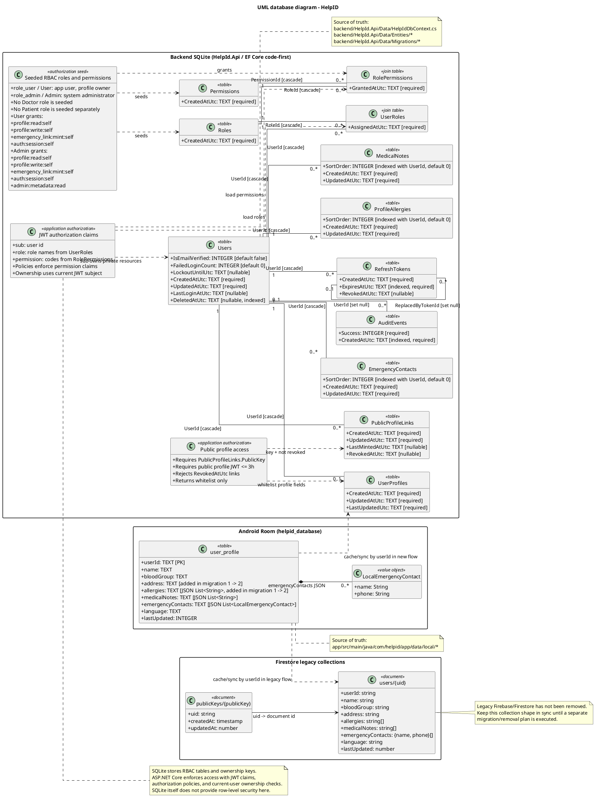

# TRƯỜNG ĐẠI HỌC

# KHOA CÔNG NGHỆ VÀ KỸ THUẬT TIÊN TIẾN

<br>

# BÁO CÁO ĐỒ ÁN CUỐI KỲ

## Môn học: An ninh thông tin

<br>

# XÂY DỰNG CÁC TÍNH NĂNG BẢO MẬT CHO PHẦN MỀM QUẢN LÝ THÔNG TIN Y TẾ KHẨN CẤP TRÊN ĐIỆN THOẠI ANDROID

<br>

**Ngành:** Khoa học và Kỹ thuật máy tính

**Sinh viên thực hiện:**

| STT | Họ và tên | Mã sinh viên |
|---:|---|---|
| 1 | Nguyễn Phương Nhung | 23110208 |
| 2 | Nguyễn Minh Đức | 22110117 |
| 3 | Đào Phương Linh | 23110186 |

**Giảng viên hướng dẫn:** Nguyễn Mạnh Thắng, Mai Đức Thọ

<br>

**Hà Nội - 2026**

<div style="page-break-after: always;"></div>

# TRƯỜNG ĐẠI HỌC

# KHOA CÔNG NGHỆ VÀ KỸ THUẬT TIÊN TIẾN

<br>

# BÁO CÁO ĐỒ ÁN CUỐI KỲ

## Môn học: An ninh thông tin

<br>

# XÂY DỰNG CÁC TÍNH NĂNG BẢO MẬT CHO PHẦN MỀM QUẢN LÝ THÔNG TIN Y TẾ KHẨN CẤP TRÊN ĐIỆN THOẠI ANDROID

<br>

**Nội dung thực hiện:** Phân tích, thiết kế, cài đặt và kiểm thử một số cơ chế bảo mật trọng tâm cho hệ thống HelpID, bao gồm xác thực sinh trắc học cục bộ, bảo vệ màn hình chứa dữ liệu nhạy cảm và ghim chứng chỉ khi kết nối tới backend.

**Phạm vi hệ thống:** Ứng dụng Android HelpID, backend ASP.NET Core/SQLite và website/Vercel API hỗ trợ truy cập hồ sơ khẩn cấp.

**Sinh viên thực hiện:**

| STT | Họ và tên | Mã sinh viên |
|---:|---|---|
| 1 | Nguyễn Phương Nhung | 23110208 |
| 2 | Nguyễn Minh Đức | 22110117 |
| 3 | Đào Phương Linh | 23110186 |

**Giảng viên hướng dẫn:** Nguyễn Mạnh Thắng, Mai Đức Thọ

<br>

**Hà Nội - 2026**

<div style="page-break-after: always;"></div>

# Mục lục

1. Danh mục ký hiệu và chữ viết tắt  
2. Danh mục hình vẽ  
3. Danh mục bảng biểu  
4. Lời cảm ơn  
5. Lời nói đầu  
6. Chương 1. Cơ sở lý thuyết và bối cảnh bài toán  
7. Chương 2. Phân tích, thiết kế và cài đặt giải pháp  
8. Chương 3. Kiểm thử và đánh giá  
9. Kết luận và hướng phát triển  
10. Tài liệu tham khảo  
11. Phụ lục  

<div style="page-break-after: always;"></div>

# Danh mục ký hiệu và chữ viết tắt

| Ký hiệu | Diễn giải |
|---|---|
| API | Application Programming Interface - giao diện lập trình ứng dụng |
| APK | Android Package Kit - gói cài đặt ứng dụng Android |
| ASP.NET Core | Nền tảng backend mã nguồn mở của Microsoft |
| CA | Certificate Authority - tổ chức phát hành chứng chỉ số |
| DAO | Data Access Object - lớp truy cập dữ liệu trong Room |
| EF Core | Entity Framework Core - ORM dùng trong backend ASP.NET Core |
| HTTPS | HTTP over TLS - giao thức HTTP được bảo vệ bằng TLS |
| JWT | JSON Web Token - chuẩn token biểu diễn các claim dưới dạng gọn nhẹ |
| MASVS | Mobile Application Security Verification Standard của OWASP |
| NFC | Near Field Communication - giao tiếp tầm gần |
| PII | Personally Identifiable Information - dữ liệu định danh cá nhân |
| QR | Quick Response code - mã phản hồi nhanh |
| RBAC | Role-Based Access Control - kiểm soát truy cập theo vai trò |
| Room | Thư viện persistence chính thức của Android trên SQLite |
| SPKI | Subject Public Key Info - phần khóa công khai trong chứng chỉ X.509 |
| TLS | Transport Layer Security - giao thức bảo mật tầng truyền tải |
| UML | Unified Modeling Language - ngôn ngữ mô hình hóa thống nhất |

# Danh mục hình vẽ

| Mã hình | Tên hình |
|---|---|
| Hình 2.1 | Sơ đồ use-case ứng dụng Android HelpID |
| Hình 2.2 | Sơ đồ use-case Website Helper ID |
| Hình 2.3 | Sơ đồ use-case Vercel Serverless API |
| Hình 2.4 | Sơ đồ cơ sở dữ liệu HelpID |
| Hình 2.5 | Luồng mở khóa sinh trắc học cục bộ |
| Hình 2.6 | Luồng bảo vệ màn hình bằng FLAG_SECURE |
| Hình 2.7 | Luồng kiểm tra ghim chứng chỉ khi gọi API |

# Danh mục bảng biểu

| Mã bảng | Tên bảng |
|---|---|
| Bảng 1.1 | Nhóm dữ liệu nhạy cảm trong hệ thống HelpID |
| Bảng 1.2 | Mối liên hệ giữa rủi ro và yêu cầu bảo vệ |
| Bảng 2.1 | Thành phần chính trong kiến trúc HelpID |
| Bảng 2.2 | Mapping tính năng bảo mật với tài sản cần bảo vệ |
| Bảng 2.3 | Thiết kế xác thực sinh trắc học cục bộ |
| Bảng 2.4 | Thiết kế bảo vệ màn hình bằng FLAG_SECURE |
| Bảng 2.5 | Thiết kế certificate pinning |
| Bảng 3.1 | Testcase xác thực sinh trắc học |
| Bảng 3.2 | Testcase bảo vệ màn hình |
| Bảng 3.3 | Testcase certificate pinning |
| Bảng 3.4 | Đánh giá yêu cầu bảo mật sau triển khai |

<div style="page-break-after: always;"></div>

# Lời cảm ơn

Nhóm thực hiện xin gửi lời cảm ơn tới các giảng viên hướng dẫn Nguyễn Mạnh Thắng và Mai Đức Thọ đã định hướng nội dung môn học, gợi mở các vấn đề thực tế trong an ninh ứng dụng di động và hỗ trợ nhóm trong quá trình hoàn thiện đồ án. Những kiến thức về xác thực, bảo vệ dữ liệu, an toàn truyền thông và kiểm thử bảo mật là cơ sở quan trọng để nhóm lựa chọn đề tài, phân tích rủi ro và triển khai các cơ chế bảo vệ phù hợp với hệ thống HelpID.

Nhóm cũng xin cảm ơn Khoa Công nghệ và Kỹ thuật tiên tiến đã tạo điều kiện học tập và thực hành. Trong quá trình thực hiện, nhóm đã có cơ hội kết hợp kiến thức lập trình Android, backend, web API, cơ sở dữ liệu và an ninh thông tin vào một hệ thống có bối cảnh sử dụng cụ thể. Đây là trải nghiệm giúp nhóm hiểu rõ hơn sự khác biệt giữa việc viết một tính năng hoạt động được và việc viết một tính năng có thể hoạt động an toàn trong môi trường chứa dữ liệu nhạy cảm.

Do phạm vi đồ án có giới hạn, báo cáo khó tránh khỏi thiếu sót. Nhóm mong nhận được nhận xét của giảng viên để tiếp tục hoàn thiện giải pháp trong các phiên bản sau.

<div style="page-break-after: always;"></div>

# Lời nói đầu

Ứng dụng di động hiện nay không chỉ phục vụ các tác vụ giao tiếp, giải trí hay giao dịch thông thường, mà còn được sử dụng trong những ngữ cảnh liên quan trực tiếp đến sức khỏe và an toàn cá nhân. Khi một ứng dụng lưu trữ thông tin y tế khẩn cấp, các yêu cầu bảo mật không còn là phần bổ sung có thể triển khai sau cùng. Bảo mật trở thành điều kiện nền để hệ thống có thể được sử dụng một cách có trách nhiệm.

HelpID là hệ thống hỗ trợ quản lý và chia sẻ thông tin y tế khẩn cấp. Ứng dụng Android cho phép người dùng lưu các thông tin như họ tên, nhóm máu, dị ứng, bệnh nền, thuốc đang dùng, địa chỉ, số điện thoại liên hệ khẩn cấp và các thông tin cần thiết khi xảy ra sự cố. Bên cạnh đó, hệ thống có backend ASP.NET Core phục vụ đăng ký, đăng nhập, quản lý hồ sơ, cấp liên kết khẩn cấp và website public để người hỗ trợ có thể xem một tập dữ liệu đã được giới hạn trong tình huống khẩn cấp.

Đặc điểm của bài toán là dữ liệu vừa có tính nhạy cảm cao vừa phải bảo đảm khả năng truy cập trong thời điểm khẩn cấp. Nếu khóa toàn bộ dữ liệu quá chặt, người hỗ trợ có thể không truy cập được thông tin cần thiết khi người dùng gặp nạn. Nếu mở dữ liệu quá rộng, thông tin y tế và định danh cá nhân có thể bị lộ. Vì vậy, hướng tiếp cận của đồ án là lựa chọn những cơ chế bảo mật có tác động trực tiếp tới các điểm rủi ro lớn: truy cập trái phép trên thiết bị, rò rỉ qua ảnh chụp màn hình và tấn công xen giữa khi ứng dụng gọi API.

Báo cáo tập trung vào ba nhóm tính năng bảo mật đã được phân tích và triển khai trong dự án:

- Xác thực sinh trắc học cục bộ để bảo vệ thao tác mở ứng dụng hoặc mở vùng dữ liệu nhạy cảm trên thiết bị.
- Bảo vệ màn hình bằng `FLAG_SECURE` và cơ chế wrapper trong Jetpack Compose để hạn chế chụp màn hình, quay màn hình và hiển thị nội dung nhạy cảm ở màn hình đa nhiệm.
- Certificate pinning dựa trên SPKI để tăng khả năng phát hiện kết nối HTTPS bị thay thế chứng chỉ khi ứng dụng Android giao tiếp với backend.

Ba cơ chế này không thay thế toàn bộ kiến trúc bảo mật của hệ thống. Backend vẫn cần xác thực bằng JWT, kiểm soát quyền, refresh token an toàn, whitelist dữ liệu public và kiểm tra ownership. Dữ liệu local vẫn cần mã hóa, cache an toàn và xử lý offline đúng cách. Tuy nhiên, ba cơ chế được chọn là những lớp bảo vệ thực tế, gần với bối cảnh người dùng cuối và có thể chứng minh bằng mã nguồn, sơ đồ thiết kế và testcase.

Nội dung báo cáo gồm ba chương chính. Chương 1 trình bày cơ sở lý thuyết và bối cảnh bài toán. Chương 2 mô tả kiến trúc HelpID, phân tích thiết kế và cài đặt các tính năng bảo mật. Chương 3 trình bày kiểm thử, đánh giá kết quả và giới hạn còn lại. Phần cuối tổng kết đóng góp của đồ án và đề xuất hướng phát triển tiếp theo.

<div style="page-break-after: always;"></div>

# Chương 1. Cơ sở lý thuyết và bối cảnh bài toán

## 1.1. Bối cảnh hệ thống HelpID

HelpID được xây dựng như một hệ thống quản lý thông tin y tế khẩn cấp trên điện thoại Android. Trong tình huống người dùng gặp tai nạn, bất tỉnh hoặc không thể tự cung cấp thông tin, người hỗ trợ cần có cách xem nhanh những dữ liệu tối thiểu như nhóm máu, dị ứng, bệnh nền, thuốc đang dùng và số liên hệ khẩn cấp. Ứng dụng đồng thời phải bảo vệ người dùng khỏi việc dữ liệu này bị đọc trái phép trong điều kiện thông thường.

Hệ thống gồm ba phần chính. Phần thứ nhất là ứng dụng Android native viết bằng Kotlin và Jetpack Compose. Ứng dụng xử lý giao diện hồ sơ y tế, đăng nhập, đăng ký, QR/NFC, SOS, lưu cache offline bằng Room, đồng bộ với Firebase legacy và backend mới. Phần thứ hai là backend ASP.NET Core dùng EF Core với SQLite, cung cấp API xác thực, quản lý hồ sơ, cấp public emergency link và kiểm soát quyền. Phần thứ ba là website React/Vite triển khai trên Vercel, có route public `/e/:publicKey` để hiển thị hồ sơ khẩn cấp đã được giới hạn dữ liệu.

Khác với một ứng dụng ghi chú hoặc danh bạ thông thường, HelpID xử lý đồng thời nhiều nhóm dữ liệu nhạy cảm. Bảng 1.1 liệt kê các nhóm dữ liệu chính và rủi ro tương ứng.

**Bảng 1.1. Nhóm dữ liệu nhạy cảm trong hệ thống HelpID**

| Nhóm dữ liệu | Ví dụ | Rủi ro nếu bị lộ |
|---|---|---|
| Dữ liệu định danh | Họ tên, tuổi, địa chỉ | Bị theo dõi, giả mạo, liên kết với dữ liệu từ nguồn khác |
| Dữ liệu y tế | Nhóm máu, dị ứng, bệnh nền, thuốc đang dùng | Lộ tình trạng sức khỏe, bị kỳ thị, bị khai thác trong lừa đảo |
| Dữ liệu liên hệ | Số điện thoại người thân, liên hệ khẩn cấp | Bị spam, lừa đảo, quấy rối |
| Dữ liệu xác thực | JWT, refresh token, Firebase ID token | Chiếm quyền truy cập tài khoản hoặc API |
| Dữ liệu vị trí | Vị trí trong luồng SOS | Theo dõi thời gian thực, xâm phạm an toàn cá nhân |
| Public key/link | Mã QR, liên kết hồ sơ công khai | Truy cập trái phép vào hồ sơ khẩn cấp nếu bị phát tán |

Vì vậy, yêu cầu bảo mật của HelpID phải được xem xét theo nhiều lớp: bảo mật trên thiết bị, bảo mật khi truyền dữ liệu, bảo mật backend, bảo mật khi chia sẻ public profile và bảo mật trong kiểm thử/vận hành.

## 1.2. Đặc thù bảo mật của dữ liệu y tế khẩn cấp

Dữ liệu y tế khẩn cấp có mâu thuẫn tự nhiên giữa tính bí mật và tính sẵn sàng. Trong điều kiện bình thường, người dùng mong muốn thông tin sức khỏe cá nhân chỉ được truy cập bởi chính họ hoặc người được phép. Trong điều kiện khẩn cấp, một phần thông tin lại cần được hiển thị nhanh cho người hỗ trợ, nhân viên y tế hoặc người thân.

Do đó, hệ thống không thể áp dụng một chính sách “ẩn tất cả” đơn giản. Thay vào đó, cần phân loại dữ liệu theo ngữ cảnh sử dụng. Dữ liệu private như tài khoản, token, cấu hình đồng bộ, refresh token, thông tin nội bộ của backend phải luôn được bảo vệ chặt. Dữ liệu public profile chỉ nên là tập con đã được whitelist, không bao gồm token, định danh kỹ thuật, thông tin thừa hoặc dữ liệu không cần thiết trong cấp cứu. Dữ liệu trên màn hình cần được bảo vệ khỏi chụp/quay màn hình trong các màn hình nhạy cảm, nhưng hệ thống vẫn phải bảo đảm người dùng có thể xem thông tin của chính mình và dùng tính năng khẩn cấp khi cần.

Trong thực tế, nhiều sự cố rò rỉ dữ liệu di động không xuất phát từ thuật toán mã hóa yếu mà đến từ các điểm rất gần người dùng: điện thoại bị người khác cầm trong thời gian ngắn, nội dung nhạy cảm xuất hiện trong app switcher, ảnh chụp màn hình được đồng bộ lên cloud, hoặc thiết bị cài chứng chỉ CA giả để chặn HTTPS. Ba cơ chế được triển khai trong đồ án hướng vào các điểm rủi ro này.

## 1.3. Xác thực sinh trắc học trên Android

Android cung cấp `BiometricPrompt` để ứng dụng hiển thị hộp thoại xác thực bằng vân tay, khuôn mặt hoặc phương thức sinh trắc học được hệ điều hành hỗ trợ. Tài liệu Android khuyến nghị dùng `BiometricPrompt` thay vì tự xây giao diện xác thực riêng, vì luồng xác thực phải được hệ điều hành kiểm soát để tránh ứng dụng giả mạo hoặc xử lý sai dữ liệu sinh trắc học [1].

Một điểm quan trọng là ứng dụng không được và không cần truy cập trực tiếp dữ liệu vân tay hay khuôn mặt. Sinh trắc học được enroll và quản lý bởi hệ điều hành. Ứng dụng chỉ nhận kết quả thành công, thất bại hoặc lỗi. Điều này giảm nguy cơ lộ dữ liệu sinh trắc học và phù hợp với nguyên tắc không thu thập dữ liệu không cần thiết.

Trong HelpID, xác thực sinh trắc học được thiết kế như một lớp mở khóa cục bộ. Nó không thay thế đăng nhập backend, không cấp JWT mới và không chứng minh danh tính với server. Người dùng vẫn phải đăng nhập vào backend/Firebase theo luồng xác thực tương ứng. Sinh trắc học chỉ giúp giảm rủi ro khi thiết bị đã đăng nhập nhưng bị người khác cầm được trong thời gian ngắn. Ví dụ, khi người dùng mở ứng dụng hoặc truy cập màn hình chứa hồ sơ y tế, hệ thống có thể yêu cầu xác thực bằng vân tay trước khi hiển thị dữ liệu.

Thiết kế này có hai lợi ích. Thứ nhất, sinh trắc học được đặt đúng phạm vi: bảo vệ truy cập local trên thiết bị. Thứ hai, hệ thống không phụ thuộc vào sinh trắc học để quyết định quyền server-side, tránh tạo cảm giác an toàn sai lệch. Nếu token backend hết hạn, bị revoke hoặc không đủ quyền, xác thực vân tay cục bộ không được phép bỏ qua kiểm tra đó.

## 1.4. Bảo vệ màn hình với FLAG_SECURE

`FLAG_SECURE` là cờ của Android `WindowManager.LayoutParams` cho phép ứng dụng yêu cầu hệ điều hành xử lý cửa sổ như nội dung bảo mật. Theo tài liệu Android, cờ này ngăn nội dung của cửa sổ xuất hiện trong ảnh chụp màn hình hoặc bị xem trên các display không bảo mật [2].

Trong ngữ cảnh HelpID, `FLAG_SECURE` phù hợp với các màn hình chứa dữ liệu y tế, số điện thoại liên hệ khẩn cấp, QR/link public hoặc thông tin định danh. Nếu không có cơ chế này, người dùng hoặc ứng dụng khác có thể chụp màn hình, quay màn hình hoặc lưu lại preview của app trong màn hình đa nhiệm. Ảnh đó có thể được đồng bộ lên cloud, chia sẻ qua ứng dụng nhắn tin hoặc bị người khác xem sau khi thiết bị mất kiểm soát.

Tuy nhiên, `FLAG_SECURE` không phải cơ chế mã hóa dữ liệu và không thể bảo vệ mọi kênh rò rỉ. Người khác vẫn có thể dùng camera ngoài để chụp màn hình. Thiết bị đã root, hệ điều hành bị sửa đổi hoặc phần mềm độc hại có đặc quyền cao vẫn có thể vượt qua một số biện pháp bảo vệ ở tầng ứng dụng. Vì vậy, báo cáo chỉ xem `FLAG_SECURE` là một lớp giảm thiểu rủi ro, không phải cam kết tuyệt đối rằng nội dung không bao giờ bị ghi lại.

Một vấn đề kỹ thuật trong Jetpack Compose là ứng dụng không có nhiều Activity tương ứng từng màn hình. Nếu bật/tắt cờ trực tiếp rải rác trong nhiều composable, rất dễ xảy ra lỗi quên tắt cờ hoặc để cờ ảnh hưởng sang màn hình không nhạy cảm. Vì vậy, đồ án thiết kế `SecureScreenWrapper` để đóng gói vòng đời bật/tắt `FLAG_SECURE` theo phạm vi màn hình.

## 1.5. HTTPS, TLS và certificate pinning

HTTPS dựa trên TLS để bảo vệ tính bí mật, toàn vẹn và xác thực máy chủ khi truyền dữ liệu qua mạng. TLS 1.3 được chuẩn hóa trong RFC 8446 và là nền tảng quan trọng cho bảo mật web hiện đại [7]. Trong mô hình thông thường, thiết bị tin tưởng một tập CA gốc. Khi ứng dụng kết nối đến server, hệ điều hành kiểm tra chuỗi chứng chỉ có được ký bởi CA tin cậy hay không và tên miền có khớp hay không.

Mô hình CA giúp HTTPS dễ triển khai, nhưng cũng tạo ra rủi ro trong một số tình huống. Nếu thiết bị bị cài thêm CA độc hại, người dùng bị ép cài cấu hình giám sát, hoặc môi trường mạng dùng proxy TLS không mong muốn, ứng dụng có thể kết nối tới một endpoint giả mạo nhưng vẫn thấy chứng chỉ được hệ thống chấp nhận. Với ứng dụng chứa dữ liệu y tế và token xác thực, rủi ro này cần được giảm thiểu.

Certificate pinning là kỹ thuật ứng dụng chỉ tin một hoặc một số chứng chỉ/khóa công khai cụ thể cho domain backend. Android Network Security Config hỗ trợ khai báo pin bằng digest của khóa công khai SPKI [3]. Khi server trình chứng chỉ không khớp pin đã khai báo, kết nối bị chặn dù chuỗi chứng chỉ có thể hợp lệ theo CA hệ thống.

Trong HelpID, certificate pinning được thiết kế cho client Android khi gọi backend HelpID API. Hướng tiếp cận là ghim SPKI thay vì ghim toàn bộ chứng chỉ. Ghim SPKI linh hoạt hơn trong trường hợp server gia hạn chứng chỉ nhưng vẫn giữ cùng cặp khóa. Đồng thời, cấu hình cần có pin dự phòng để tránh làm ứng dụng mất kết nối hoàn toàn khi xoay khóa. Với môi trường debug/local, cấu hình cần tách rõ để tránh phá vỡ quy trình phát triển, nhưng bản release không được vô tình chấp nhận CA debug hoặc bỏ qua pin.

## 1.6. JWT và xác thực backend

Backend HelpID sử dụng JWT access token để xác thực các request API. RFC 7519 định nghĩa JWT là một dạng biểu diễn claim gọn nhẹ, URL-safe, có thể được ký hoặc mã hóa tùy cách sử dụng [6]. Trong hệ thống HelpID, JWT dùng cho xác thực người dùng, còn refresh token được xoay vòng và revoke khi cần.

Điểm cần nhấn mạnh là JWT chỉ an toàn khi được bảo vệ đúng vòng đời. Token không được ghi log, không được đưa vào tài liệu testcase, không được lưu trong nơi dễ đọc và phải được truyền qua kênh HTTPS. Nếu token bị lộ, kẻ tấn công có thể gọi API như người dùng trong thời hạn token còn hiệu lực. Vì vậy, certificate pinning không thay thế JWT, mà bổ sung bảo vệ cho kênh truyền token và dữ liệu.

ASP.NET Core cung cấp hệ thống authentication/authorization tách biệt, trong đó authentication xác định danh tính người gọi còn authorization quyết định người đó có được thực hiện hành động hay không [8]. Backend HelpID áp dụng nguyên tắc này qua đăng ký/đăng nhập, refresh token, current user context, role/permission và ownership policy. Với public profile, backend chỉ trả về các trường được whitelist, không trả toàn bộ hồ sơ private.

## 1.7. Room, lưu trữ local và dữ liệu offline

Ứng dụng HelpID cần hoạt động trong tình huống mạng không ổn định. Vì vậy, dữ liệu hồ sơ được cache local bằng Room. Room là thư viện persistence của Android, cung cấp lớp trừu tượng trên SQLite và hỗ trợ kiểm tra truy vấn ở thời điểm biên dịch [4]. Việc dùng Room giúp code truy cập dữ liệu rõ ràng hơn so với thao tác SQLite trực tiếp, đồng thời hỗ trợ migration khi schema thay đổi.

Từ góc nhìn bảo mật, cache offline là con dao hai lưỡi. Nó giúp người dùng vẫn xem được hồ sơ khi mất mạng, nhưng cũng làm tăng lượng dữ liệu nhạy cảm nằm trên thiết bị. Do đó, cache cần kết hợp với bảo vệ khóa local, xác thực sinh trắc học khi mở dữ liệu, hạn chế log và xóa/sync cẩn trọng. Trong phạm vi báo cáo, sinh trắc học và bảo vệ màn hình là hai lớp trực tiếp giảm rủi ro khi dữ liệu đã tồn tại trên thiết bị.

## 1.8. Chuẩn kiểm thử bảo mật di động

OWASP Mobile Application Security là bộ tài liệu phổ biến cho kiểm thử và đánh giá bảo mật ứng dụng di động. Dự án này bao gồm MASVS, MASWE và MASTG, cung cấp chuẩn yêu cầu, phân loại lỗi và hướng dẫn kiểm thử cho ứng dụng mobile [5]. Trong đồ án, các testcase không nhằm chứng nhận đầy đủ theo OWASP MASVS, nhưng được tổ chức theo tinh thần của chuẩn này: xác định tài sản cần bảo vệ, mô tả rủi ro, kiểm tra hành vi kỳ vọng và ghi nhận giới hạn.

Đối với HelpID, kiểm thử bảo mật cần bao phủ ít nhất ba nhóm. Nhóm thứ nhất là kiểm thử chức năng bảo mật: xác thực sinh trắc học có chặn truy cập khi thất bại hay không, `FLAG_SECURE` có bật đúng màn hình hay không, pinning có chặn chứng chỉ sai hay không. Nhóm thứ hai là kiểm thử hồi quy: tính năng bảo mật không được làm hỏng đăng nhập, QR, SOS, offline cache hoặc luồng public profile. Nhóm thứ ba là kiểm thử failure mode: thiết bị không có sinh trắc học, người dùng hủy prompt, backend dùng chứng chỉ khác, mất mạng, token hết hạn.

## 1.9. Mối liên hệ giữa rủi ro và yêu cầu bảo vệ

Các cơ chế bảo mật trong đồ án được lựa chọn dựa trên rủi ro cụ thể của hệ thống. Bảng 1.2 tóm tắt mối liên hệ giữa rủi ro, lớp bảo vệ và kỳ vọng sau triển khai.

**Bảng 1.2. Mối liên hệ giữa rủi ro và yêu cầu bảo vệ**

| Rủi ro | Tài sản bị ảnh hưởng | Cơ chế bảo vệ | Kỳ vọng |
|---|---|---|---|
| Người khác cầm thiết bị đã đăng nhập | Hồ sơ y tế local, màn hình profile | Xác thực sinh trắc học cục bộ | Không hiển thị dữ liệu nhạy cảm trước khi người dùng xác thực |
| Ảnh chụp/quay màn hình bị lưu hoặc chia sẻ | Nhóm máu, dị ứng, QR, số liên hệ | `FLAG_SECURE` | Hệ điều hành chặn ảnh chụp/quay màn hình ở màn hình nhạy cảm |
| HTTPS bị MITM bởi CA/proxy không mong muốn | Token, profile, request API | Certificate pinning SPKI | Ứng dụng từ chối kết nối khi khóa công khai server không khớp pin |
| Backend bị gọi bằng token không hợp lệ | Hồ sơ private, public link | JWT và authorization | API trả lỗi, không tiết lộ dữ liệu |
| Public profile trả quá nhiều trường | Dữ liệu private | Whitelist field | Website chỉ hiển thị dữ liệu cần thiết cho cấp cứu |
| Mạng mất trong tình huống khẩn cấp | Khả năng xem hồ sơ | Room cache/offline flow | Người dùng vẫn xem được dữ liệu đã cache |

Ba tính năng trọng tâm không thể giải quyết mọi rủi ro, nhưng chúng tạo thành các lớp bảo vệ rõ ràng: kiểm soát truy cập local, giảm rò rỉ qua giao diện và tăng độ tin cậy của kênh truyền.


## 1.10. Mô hình đe dọa cho hệ thống HelpID

Để lựa chọn đúng cơ chế bảo vệ, cần mô tả rõ đối tượng tấn công, khả năng của họ và tài sản họ có thể nhắm tới. Với HelpID, mô hình đe dọa không chỉ gồm hacker từ xa tấn công backend, mà còn gồm các tình huống rất đời thường: người khác cầm điện thoại đã mở khóa, ảnh chụp màn hình bị đồng bộ lên cloud, mạng WiFi công cộng bị giám sát, hoặc người dùng vô tình cài chứng chỉ CA không đáng tin cậy. Các tình huống này phù hợp với đặc thù của ứng dụng di động, nơi dữ liệu nhạy cảm thường được hiển thị trực tiếp trên màn hình và được truyền qua nhiều môi trường mạng khác nhau.

Mô hình đe dọa của đồ án được xây dựng theo ba lớp. Lớp thứ nhất là lớp thiết bị, bao gồm truy cập vật lý ngắn hạn, màn hình đang mở, dữ liệu cache local, preview trong app switcher và khả năng chụp/quay màn hình. Lớp thứ hai là lớp truyền thông, bao gồm HTTPS, chứng chỉ, proxy TLS, CA cài thêm và nguy cơ MITM. Lớp thứ ba là lớp backend/API, bao gồm xác thực, phân quyền, public profile, token và kiểm soát dữ liệu trả về. Ba lớp này liên kết với nhau qua vòng đời dữ liệu: dữ liệu được nhập ở thiết bị, lưu local, đồng bộ qua mạng, lưu backend, rồi có thể được chia sẻ qua public link.

**Bảng 1.3. Mô hình đe dọa theo lớp bảo vệ**

| Lớp | Tác nhân đe dọa | Khả năng giả định | Tài sản bị nhắm tới | Cơ chế giảm thiểu |
|---|---|---|---|---|
| Thiết bị | Người quen, người lạ cầm máy trong thời gian ngắn | Mở ứng dụng khi thiết bị đã unlock | Hồ sơ y tế local, số liên hệ, QR | Xác thực sinh trắc học local |
| Thiết bị | Ứng dụng/luồng hệ thống ghi màn hình | Chụp screenshot, quay màn hình, lưu thumbnail | Nội dung đang hiển thị | `FLAG_SECURE`, wrapper theo màn hình |
| Thiết bị | Người dùng vô tình chia sẻ ảnh | Gửi ảnh chụp qua chat/email | Dữ liệu y tế, số điện thoại | Hạn chế capture, dùng chia sẻ có kiểm soát |
| Mạng | Kẻ tấn công cùng WiFi | MITM, DNS spoof, TLS proxy | Token, request API, profile | HTTPS, certificate pinning |
| Mạng | CA/proxy không đáng tin | Thiết bị tin chứng chỉ giả | Kênh API backend | SPKI pinning, tách debug/release |
| Backend | Người dùng không có quyền | Gọi API với token sai/hết hạn | Hồ sơ private | JWT, authorization, ownership |
| Public web | Người có public key | Truy cập route `/e/:publicKey` | Public profile | Whitelist field, no-store, giới hạn dữ liệu |
| Vận hành | Lập trình viên hoặc log collector | Xem log/testcase/build output | Token, dữ liệu y tế | Quy tắc không log dữ liệu nhạy cảm |

Mô hình này cũng giúp tránh sai lầm khi đánh giá một tính năng bảo mật ngoài phạm vi của nó. Ví dụ, sinh trắc học không ngăn MITM; certificate pinning không ngăn người khác nhìn màn hình; `FLAG_SECURE` không quyết định quyền API. Nếu báo cáo trộn lẫn các phạm vi này, kết luận bảo mật sẽ thiếu chính xác. Vì vậy, mỗi tính năng trong đồ án được gắn với một nhóm đe dọa cụ thể và được kiểm thử theo đúng nhóm đó.

Một điểm quan trọng khác là HelpID phải bảo vệ cả tính bí mật và tính sẵn sàng. Với ứng dụng ngân hàng, có thể khóa chặt nhiều luồng khi nghi ngờ rủi ro. Với ứng dụng y tế khẩn cấp, nếu khóa quá mức, người hỗ trợ có thể không xem được thông tin cần thiết. Vì vậy, mô hình đe dọa của HelpID không thể chỉ hỏi “làm sao để không ai xem được dữ liệu”, mà phải hỏi thêm “dữ liệu tối thiểu nào cần sẵn sàng trong cấp cứu, và dữ liệu nào không nên public trong mọi trường hợp”.

## 1.11. Yêu cầu phi chức năng về bảo mật

Ngoài các yêu cầu chức năng như đăng nhập, chỉnh sửa hồ sơ, tạo QR hay gửi SOS, HelpID cần các yêu cầu phi chức năng liên quan đến bảo mật. Những yêu cầu này không luôn xuất hiện như một nút bấm trên giao diện, nhưng quyết định hệ thống có thể vận hành an toàn hay không.

**Bảng 1.4. Yêu cầu phi chức năng về bảo mật**

| Mã | Yêu cầu | Diễn giải | Liên hệ với đồ án |
|---|---|---|---|
| NFR-SEC-01 | Bảo vệ truy cập local | Dữ liệu nhạy cảm không hiển thị ngay khi mở app trong trạng thái cần khóa | Biometric unlock |
| NFR-SEC-02 | Bảo vệ nội dung hiển thị | Màn hình chứa dữ liệu y tế/QR không bị capture dễ dàng | `FLAG_SECURE` |
| NFR-SEC-03 | Bảo vệ kênh truyền | App không gửi token/profile qua kênh HTTPS bị thay chứng chỉ | Certificate pinning |
| NFR-SEC-04 | Giảm dữ liệu public | Public profile chỉ chứa trường cần cho cấp cứu | Backend whitelist/API proxy |
| NFR-SEC-05 | Không lộ secret trong client | Secret server-side không đưa vào Vite bundle hoặc APK | Quy tắc cấu hình và review |
| NFR-SEC-06 | Không log dữ liệu nhạy cảm | Log/testcase không chứa token, số điện thoại, vị trí, dữ liệu y tế | Quy tắc phát triển |
| NFR-SEC-07 | Hỗ trợ offline có kiểm soát | Có cache khi mất mạng nhưng không mở rộng dữ liệu public | Room cache, unlock local |
| NFR-SEC-08 | Failure mode an toàn | Khi lỗi bảo mật xảy ra, app không crash và không lộ dữ liệu | Error handling, testcase |

Những yêu cầu trên giúp đánh giá đồ án ở mức hệ thống thay vì chỉ nhìn từng hàm. Ví dụ, certificate pinning có thể được cài đặt đúng, nhưng nếu error handler ghi URL kèm token vào log thì yêu cầu bảo mật vẫn bị vi phạm. Tương tự, `FLAG_SECURE` có thể bật đúng ở một màn hình, nhưng nếu một màn hình khác cũng hiển thị dữ liệu y tế mà không được bọc wrapper thì yêu cầu bảo vệ nội dung hiển thị chưa đạt.

Trong báo cáo, ba tính năng trọng tâm được trình bày như ba đáp án cho ba yêu cầu phi chức năng đầu tiên. Các yêu cầu còn lại được xem như nền kiểm soát để bảo đảm ba tính năng không gây tác dụng phụ. Điều này phù hợp với tư duy defense-in-depth: mỗi lớp bảo vệ làm tốt một việc, và hệ thống an toàn hơn nhờ nhiều lớp phối hợp.

## 1.12. Cân bằng giữa bảo mật và khả dụng trong tình huống khẩn cấp

Điểm khó của HelpID nằm ở việc dữ liệu nhạy cảm lại có giá trị cao nhất khi người dùng không thể tự mở khóa hoặc tự giải thích. Nếu thiết kế chỉ ưu tiên bí mật, ứng dụng có thể trở nên vô dụng trong cấp cứu. Nếu thiết kế chỉ ưu tiên khả dụng, dữ liệu y tế riêng tư có thể bị truy cập tùy tiện. Vì vậy, nhóm tiếp cận bài toán theo nguyên tắc phân tầng dữ liệu.

Tầng dữ liệu private gồm toàn bộ hồ sơ đầy đủ, token, refresh token, cấu hình đồng bộ và dữ liệu nội bộ. Tầng này chỉ dành cho người dùng đã xác thực và các API có kiểm soát quyền. Tầng dữ liệu local hiển thị trong app cần có lớp mở khóa sinh trắc học và bảo vệ màn hình. Tầng public emergency profile chỉ gồm một tập trường đã được chọn trước để phục vụ cấp cứu. Tầng vận hành gồm log/testcase/changelog, tuyệt đối không được chứa dữ liệu nhạy cảm thật.

**Bảng 1.5. Phân tầng dữ liệu và chính sách truy cập**

| Tầng dữ liệu | Ví dụ | Ai được truy cập | Cơ chế bảo vệ |
|---|---|---|---|
| Private backend | Hồ sơ đầy đủ, thông tin tài khoản | Chủ tài khoản, API có quyền | JWT, authorization, ownership |
| Local sensitive screen | Hồ sơ đang hiển thị trong app | Người dùng đang cầm thiết bị và xác thực local | Biometric, `FLAG_SECURE` |
| Public emergency profile | Nhóm máu, dị ứng, liên hệ cấp cứu theo whitelist | Người có public key/link | Public key, whitelist field, no-store |
| Transport data | Request/response API, token | Client và backend hợp lệ | HTTPS, SPKI pinning |
| Operational data | Log, testcase, changelog | Nhóm phát triển | Không ghi PII/token/secret |

Phân tầng này cũng giúp giải thích vì sao đồ án không khóa public profile bằng biometric. Người hỗ trợ trong cấp cứu không có vân tay của người dùng. Nếu yêu cầu biometric cho public profile, tính năng QR khẩn cấp mất ý nghĩa. Ngược lại, màn hình chỉnh sửa hồ sơ trong app không cần public rộng, nên có thể yêu cầu mở khóa local và chống chụp màn hình. Mỗi tầng dữ liệu có chính sách bảo vệ riêng, phù hợp với mục đích sử dụng.

## 1.13. Các tiêu chí đánh giá thành công

Một tính năng bảo mật chỉ được xem là thành công khi đạt được cả ba tiêu chí: đúng chức năng, đúng phạm vi và không tạo hồi quy nghiêm trọng. Đúng chức năng nghĩa là cơ chế hoạt động theo kỳ vọng: biometric chặn khi thất bại, `FLAG_SECURE` chặn capture, pinning chặn chứng chỉ sai. Đúng phạm vi nghĩa là tính năng không bị thổi phồng: biometric không thay backend auth, pinning không thay authorization, `FLAG_SECURE` không thay mã hóa. Không tạo hồi quy nghĩa là app vẫn đăng nhập, xem hồ sơ, tạo QR, xử lý offline và báo lỗi hợp lý.

**Bảng 1.6. Tiêu chí đánh giá thành công của ba tính năng trọng tâm**

| Tính năng | Tiêu chí đúng chức năng | Tiêu chí đúng phạm vi | Tiêu chí không hồi quy |
|---|---|---|---|
| Biometric | Prompt hoạt động, hủy/thất bại không mở khóa | Chỉ là unlock local | Không phá luồng backend token và public emergency flow |
| `FLAG_SECURE` | Screenshot/recording bị chặn ở màn hình nhạy cảm | Không tuyên bố chống camera/root tuyệt đối | Không bật nhầm ở màn hình không nhạy cảm |
| Pinning | Chứng chỉ sai bị chặn, pin đúng cho phép kết nối | Không thay HTTPS/JWT/authorization | Không làm app crash, phân biệt offline và MITM |

Các tiêu chí này được dùng xuyên suốt Chương 2 và Chương 3. Khi mô tả thiết kế, báo cáo nêu rõ phạm vi và giới hạn. Khi mô tả kiểm thử, báo cáo không chỉ ghi “pass” mà còn nêu expected result và actual result. Cách trình bày này giúp người đọc đánh giá được chất lượng triển khai thay vì chỉ thấy danh sách tính năng.

<div style="page-break-after: always;"></div>

# Chương 2. Phân tích, thiết kế và cài đặt giải pháp

## 2.1. Tổng quan kiến trúc HelpID

Kiến trúc HelpID được tổ chức theo ba boundary chính: ứng dụng Android, website Helper ID và serverless API/backend. Mỗi boundary có vai trò riêng trong luồng dữ liệu và bảo mật. Ứng dụng Android là nơi người dùng nhập, chỉnh sửa, xem và chia sẻ hồ sơ. Backend ASP.NET Core xử lý xác thực, phân quyền, lưu hồ sơ private, cấp public key và phục vụ public profile đã lọc. Website Helper ID hiển thị hồ sơ khẩn cấp từ public key. Vercel API đóng vai trò proxy hoặc API legacy trong một số luồng.

**Bảng 2.1. Thành phần chính trong kiến trúc HelpID**

| Thành phần | Công nghệ | Vai trò |
|---|---|---|
| Android app | Kotlin, Jetpack Compose, Room, Firebase, WorkManager | Giao diện chính, lưu cache offline, SOS, QR/NFC, gọi backend |
| Backend API | ASP.NET Core, EF Core, SQLite | Auth, JWT, refresh token, profile private, public emergency link |
| Website | React, Vite, Tailwind CDN | Marketing site và route public `/e/:publicKey` |
| Vercel API | Serverless JavaScript | Proxy profile, mint legacy, Gemini proxy |
| Database local | Room/SQLite | Cache hồ sơ và pending sync |
| Database backend | SQLite qua EF Core | User, profile, role/permission, token, public link |
| Firestore legacy | Firebase Auth/Firestore | Luồng cũ vẫn tồn tại song song |

Các sơ đồ dưới đây được lấy từ tài liệu kỹ thuật của dự án để thể hiện system boundary và luồng chính.

{width=95%}

{width=95%}

{width=95%}

{width=95%}

## 2.2. Phân tích tài sản cần bảo vệ

Trong thiết kế bảo mật, bước đầu tiên là xác định tài sản. Với HelpID, tài sản không chỉ là “dữ liệu” nói chung mà gồm nhiều loại có vòng đời và mức nhạy cảm khác nhau. Hồ sơ y tế private nằm trong backend và cache local cần mức bảo vệ cao nhất. Public profile cần khả dụng trong cấp cứu nhưng phải được giới hạn trường. Token xác thực cần tránh lộ trong log, testcase và giao diện. Mã QR/link public cần được tạo và quản lý sao cho người xem chỉ truy cập được dữ liệu cần thiết.

**Bảng 2.2. Mapping tính năng bảo mật với tài sản cần bảo vệ**

| Tính năng | Tài sản bảo vệ chính | Phạm vi tác động | Không thay thế |
|---|---|---|---|
| Xác thực sinh trắc học | Dữ liệu local và màn hình nhạy cảm | Thiết bị Android | Không thay thế đăng nhập backend/JWT |
| `FLAG_SECURE` | Nội dung đang hiển thị | Window Android và app switcher | Không mã hóa dữ liệu, không chống camera ngoài |
| Certificate pinning | Token và dữ liệu trên đường truyền | Kết nối Android tới backend | Không thay thế HTTPS, không thay authorization |
| JWT/authorization | API private và ownership | Backend | Không bảo vệ nếu token bị lộ khỏi thiết bị |
| Public whitelist | Hồ sơ khẩn cấp public | Backend và Vercel API | Không thay user consent hoặc quản lý public key |

Đồ án tập trung vào ba tính năng đầu tiên vì đây là các lớp bảo vệ có thể triển khai trực tiếp trong ứng dụng Android và chứng minh bằng testcase. Các cơ chế backend như JWT, role/permission và public whitelist được sử dụng như nền bảo mật sẵn có của hệ thống, đồng thời được nhắc tới để đặt đúng phạm vi cho ba tính năng.

## 2.3. Thiết kế xác thực sinh trắc học cục bộ

### 2.3.1. Mục tiêu thiết kế

Mục tiêu của xác thực sinh trắc học trong HelpID là giảm nguy cơ người khác đọc được dữ liệu y tế khi thiết bị đã đăng nhập. Trong mô hình sử dụng thông thường, người dùng có thể đã đăng nhập từ trước và token còn hiệu lực. Nếu điện thoại không khóa, hoặc người khác cầm được thiết bị trong thời gian ngắn, họ có thể mở ứng dụng và xem dữ liệu. Yêu cầu bổ sung một lớp xác thực local trước khi hiển thị màn hình nhạy cảm là hợp lý.

Thiết kế phải thỏa mãn các yêu cầu sau:

- Không lưu trữ dữ liệu vân tay, khuôn mặt hoặc template sinh trắc học trong ứng dụng.
- Dùng API chính thức của Android để hiển thị prompt xác thực.
- Có fallback khi thiết bị không hỗ trợ sinh trắc học hoặc người dùng chưa enroll.
- Không coi xác thực local là bằng chứng đăng nhập backend.
- Không làm hỏng luồng khẩn cấp cần khả dụng theo thiết kế của ứng dụng.
- Trạng thái mở khóa chỉ có hiệu lực trong phạm vi local và cần được reset theo vòng đời phù hợp.

### 2.3.2. Luồng xử lý

Luồng xử lý sinh trắc học được mô tả ở Hình 2.5.

```text
Người dùng mở ứng dụng hoặc màn hình nhạy cảm
        |
        v
Ứng dụng kiểm tra trạng thái yêu cầu khóa sinh trắc học
        |
        v
Thiết bị có hỗ trợ và đã enroll sinh trắc học?
        | Có
        v
Hiển thị BiometricPrompt do hệ điều hành quản lý
        |
        +-- Thành công --> Cho phép hiển thị nội dung nhạy cảm
        |
        +-- Hủy/thất bại/lỗi --> Giữ trạng thái khóa hoặc dùng fallback hợp lệ
        |
        Không
        v
Hiển thị fallback theo chính sách: khóa màn hình thiết bị hoặc thông báo cấu hình
```

**Hình 2.5. Luồng mở khóa sinh trắc học cục bộ**

Luồng này thể hiện nguyên tắc “fail closed” đối với màn hình nhạy cảm. Nếu xác thực không thành công, ứng dụng không được hiển thị dữ liệu. Nếu người dùng hủy prompt, ứng dụng cần giữ nguyên trạng thái khóa thay vì coi đó là thành công. Nếu thiết bị không hỗ trợ sinh trắc học, ứng dụng có thể dùng xác thực thiết bị nếu cấu hình cho phép hoặc thông báo người dùng cần bật bảo vệ thiết bị.

### 2.3.3. Cài đặt trong Android

Ở tầng Android, tính năng được triển khai bằng `BiometricPrompt` và các lớp hỗ trợ kiểm tra khả dụng của sinh trắc học. Thành phần điều phối có trách nhiệm:

- Kiểm tra khả năng xác thực bằng `BiometricManager`.
- Tạo prompt với tiêu đề, mô tả và chính sách fallback phù hợp.
- Nhận callback thành công, thất bại, lỗi hoặc hủy.
- Cập nhật state Compose để màn hình nhạy cảm chỉ render khi đã unlock.
- Không ghi log dữ liệu nhạy cảm hoặc thông tin xác thực.

Với Jetpack Compose, trạng thái khóa/mở khóa được quản lý như một phần của state giao diện. Các composable chứa dữ liệu nhạy cảm cần phụ thuộc vào state này. Khi state chưa mở khóa, giao diện chỉ hiển thị lớp yêu cầu xác thực hoặc trạng thái rỗng an toàn. Khi callback thành công, state chuyển sang mở khóa và nội dung được render.

**Bảng 2.3. Thiết kế xác thực sinh trắc học cục bộ**

| Nội dung | Thiết kế áp dụng |
|---|---|
| API chính | Android `BiometricPrompt` |
| Phạm vi | Mở khóa local cho màn hình/tác vụ nhạy cảm |
| Dữ liệu sinh trắc học | Không lưu trong app |
| Thành công | Cho phép render nội dung nhạy cảm |
| Thất bại/hủy/lỗi | Không render nội dung nhạy cảm |
| Fallback | Theo khả năng thiết bị và chính sách ứng dụng |
| Backend auth | Vẫn dùng token và authorization riêng |
| Logging | Không ghi token, dữ liệu y tế, số điện thoại, vị trí |

### 2.3.4. Phân tích an toàn

Sinh trắc học giúp cải thiện bảo mật trong một tập tình huống cụ thể: thiết bị đã đăng nhập nhưng chưa được khóa hoặc người dùng giao điện thoại cho người khác trong thời gian ngắn. Khi đó, người khác không thể chỉ mở ứng dụng để đọc hồ sơ nếu chưa vượt qua xác thực local.

Tuy nhiên, sinh trắc học không xử lý các rủi ro khác như token bị đánh cắp từ bộ nhớ, backend phân quyền sai, thiết bị bị malware có đặc quyền cao hoặc người dùng đã mở khóa và để màn hình hiển thị. Vì vậy, báo cáo không trình bày sinh trắc học như một cơ chế xác thực toàn hệ thống. Nó là một lớp bảo vệ tại điểm sử dụng, kết hợp với các lớp khác.

## 2.4. Thiết kế bảo vệ màn hình bằng FLAG_SECURE

### 2.4.1. Mục tiêu thiết kế

Nhiều dữ liệu trong HelpID được hiển thị trực tiếp trên màn hình: nhóm máu, dị ứng, bệnh nền, số điện thoại liên hệ khẩn cấp, QR code, thông tin public link. Nếu người dùng hoặc ứng dụng khác chụp màn hình, dữ liệu có thể bị lưu ngoài vùng kiểm soát của HelpID. Ảnh chụp màn hình thường được đồng bộ với thư viện ảnh, cloud hoặc gửi qua ứng dụng chat. Khi đó, ngay cả khi ứng dụng đã mã hóa storage, dữ liệu vẫn có thể bị lộ qua ảnh.

Mục tiêu của `FLAG_SECURE` là yêu cầu hệ điều hành hạn chế chụp/quay màn hình và preview trong màn hình đa nhiệm đối với các màn hình nhạy cảm. Vì HelpID dùng Compose, thiết kế cần có wrapper rõ ràng để bật/tắt cờ theo vòng đời composable.

### 2.4.2. Luồng xử lý

```text
Composable màn hình nhạy cảm được mount
        |
        v
SecureScreenWrapper lấy Activity Window hiện tại
        |
        v
Thêm FLAG_SECURE vào Window
        |
        v
Người dùng xem nội dung nhạy cảm
        |
        +-- Chụp/quay màn hình --> Hệ điều hành chặn hoặc làm trống nội dung
        |
        v
Composable rời khỏi composition
        |
        v
SecureScreenWrapper gỡ FLAG_SECURE theo phạm vi
```

**Hình 2.6. Luồng bảo vệ màn hình bằng FLAG_SECURE**

Điểm quan trọng là cờ phải được gỡ khi màn hình không còn cần bảo vệ. Nếu không, các màn hình không nhạy cảm như login, register hoặc marketing có thể bị chặn chụp màn hình không cần thiết. Ngược lại, nếu quên bật cờ ở một màn hình chứa QR hoặc profile, dữ liệu có thể bị lộ.

### 2.4.3. Cài đặt wrapper trong Compose

Trong Compose, một mẫu triển khai phù hợp là dùng `DisposableEffect`. Khi composable được đưa vào composition, `DisposableEffect` bật `FLAG_SECURE`. Khi composable rời khỏi composition, khối `onDispose` khôi phục trạng thái. Thiết kế này giúp logic bảo vệ gắn với vòng đời giao diện thay vì rải rác ở các hàm xử lý sự kiện.

Các màn hình hoặc vùng giao diện cần bọc bằng `SecureScreenWrapper` gồm:

- Màn hình hồ sơ y tế khẩn cấp.
- Màn hình chỉnh sửa hồ sơ có dữ liệu y tế và liên hệ.
- Màn hình QR public link hoặc NFC beam.
- Màn hình hiển thị thông tin định danh, token hoặc dữ liệu có tính riêng tư nếu có.

**Bảng 2.4. Thiết kế bảo vệ màn hình bằng FLAG_SECURE**

| Nội dung | Thiết kế áp dụng |
|---|---|
| API chính | `WindowManager.LayoutParams.FLAG_SECURE` |
| Cơ chế Compose | `SecureScreenWrapper` với vòng đời mount/dispose |
| Phạm vi | Màn hình hoặc vùng chứa dữ liệu nhạy cảm |
| Khi vào màn hình | Bật cờ bảo vệ trên window |
| Khi rời màn hình | Gỡ cờ hoặc khôi phục trạng thái trước đó |
| Kỳ vọng | Chặn screenshot/screen recording/app switcher preview theo hỗ trợ của hệ điều hành |
| Giới hạn | Không chống camera ngoài, root/hook, hệ điều hành bị sửa đổi |

### 2.4.4. Phân tích an toàn

`FLAG_SECURE` là biện pháp có chi phí triển khai thấp nhưng hiệu quả thực tế cao với các tình huống rò rỉ phổ biến. Nó không cần thay đổi dữ liệu, không yêu cầu backend và không ảnh hưởng tới mô hình xác thực. Vì vậy, đây là lớp bảo vệ phù hợp cho một ứng dụng hiển thị dữ liệu y tế.

Tuy nhiên, `FLAG_SECURE` cũng có thể ảnh hưởng tới trải nghiệm người dùng. Người dùng không thể chụp lại màn hình hồ sơ để gửi cho bác sĩ trong một số tình huống hợp pháp. Với HelpID, đánh đổi này được chấp nhận ở các màn hình nhạy cảm vì ứng dụng đã có luồng chia sẻ có kiểm soát hơn như QR/public link. Nếu cần hỗ trợ chia sẻ ảnh trong tương lai, nên thiết kế tính năng export có xác nhận rõ ràng thay vì cho phép chụp tự do.

## 2.5. Thiết kế certificate pinning

### 2.5.1. Mục tiêu thiết kế

HelpID truyền dữ liệu nhạy cảm giữa Android app và backend. Dù HTTPS đã cung cấp bảo mật tầng truyền tải, ứng dụng vẫn có nguy cơ bị tấn công trong các môi trường mà trust store của thiết bị bị thay đổi hoặc người dùng cài CA giám sát. Certificate pinning giúp ứng dụng từ chối kết nối nếu khóa công khai của server không khớp với pin đã cấu hình.

Mục tiêu triển khai gồm:

- Chỉ áp dụng pinning cho domain backend cần bảo vệ.
- Dùng SPKI pin để linh hoạt hơn khi gia hạn chứng chỉ.
- Có pin dự phòng để hỗ trợ xoay khóa.
- Tách cấu hình debug và release rõ ràng.
- Không chấp nhận pin sai trong release.
- Không làm lộ token hoặc dữ liệu khi kết nối bị chặn.

### 2.5.2. Luồng xử lý

```text
Android app tạo request HTTPS tới backend
        |
        v
TLS handshake và kiểm tra chuỗi chứng chỉ thông thường
        |
        v
Network Security Config kiểm tra SPKI pin
        |
        +-- Pin khớp --> Cho phép request tiếp tục
        |
        +-- Pin không khớp --> Chặn kết nối, trả lỗi mạng an toàn
```

**Hình 2.7. Luồng kiểm tra ghim chứng chỉ khi gọi API**

Trong luồng này, pinning không thay thế kiểm tra CA và hostname. Nó bổ sung một điều kiện: khóa công khai của chứng chỉ server phải nằm trong tập pin được tin cậy. Nếu server bị thay chứng chỉ bởi proxy hoặc attacker, request không được gửi tiếp.

### 2.5.3. Cấu hình Network Security Config

Android hỗ trợ Network Security Config để khai báo chính sách bảo mật mạng theo domain. Với pinning, cấu hình bao gồm domain backend, digest algorithm và giá trị pin. Cách làm này phù hợp với HelpID vì logic pinning nằm trong cấu hình nền tảng thay vì tự viết trust manager thủ công. Tự viết trust manager thường dễ tạo lỗi nghiêm trọng như bỏ qua hostname verification hoặc chấp nhận mọi chứng chỉ trong debug rồi vô tình đưa vào release.

**Bảng 2.5. Thiết kế certificate pinning**

| Nội dung | Thiết kế áp dụng |
|---|---|
| Cơ chế chính | Android Network Security Config |
| Loại pin | SPKI SHA-256 |
| Phạm vi | Domain backend HelpID API |
| Release | Bật pin chính thức, không tin CA debug ngoài ý muốn |
| Debug/local | Có cấu hình tách biệt để phục vụ phát triển |
| Pin dự phòng | Có để xoay khóa an toàn |
| Khi pin sai | Chặn kết nối, không gửi dữ liệu nhạy cảm |
| Logging | Không ghi access token, refresh token hoặc dữ liệu y tế |

### 2.5.4. Quản trị vòng đời pin

Certificate pinning có rủi ro vận hành: nếu pin hết hạn, server đổi khóa mà app chưa cập nhật hoặc người dùng chưa nâng cấp app, ứng dụng có thể mất kết nối backend. Do đó, thiết kế cần có chiến lược vòng đời:

- Luôn có ít nhất một pin dự phòng tương ứng khóa sẽ dùng trong lần xoay tiếp theo.
- Ghi rõ quy trình thay pin trước khi đổi khóa production.
- Không hard-code pin tạm thời của môi trường local vào release.
- Có testcase phát hiện pin sai trước khi phát hành.
- Có thông báo lỗi người dùng ở mức phù hợp khi kết nối bị chặn, tránh hiển thị stack trace.

Trong phạm vi đồ án, pinning được đánh giá là phù hợp vì ứng dụng xử lý dữ liệu y tế và token. Tuy nhiên, nhóm không trình bày pinning như giải pháp “càng nhiều càng tốt”. Nó cần được quản trị cẩn thận để tránh biến lỗi cấu hình thành sự cố mất dịch vụ.

## 2.6. Liên hệ với backend và public profile

Ba tính năng trên nằm chủ yếu ở ứng dụng Android, nhưng phải đặt trong kiến trúc tổng thể. Backend vẫn là nơi quyết định quyền truy cập dữ liệu private. Khi người dùng đăng nhập, backend cấp access token và refresh token. Access token dùng cho request private; refresh token cần được bảo vệ và xoay vòng. Khi người dùng tạo link khẩn cấp, backend cấp public key và chỉ cho phép truy cập tập dữ liệu đã whitelist.

Website Helper ID không nên tự tin vào dữ liệu từ client. Route `/e/:publicKey` gọi API profile và hiển thị dữ liệu khẩn cấp. API proxy server-side cần sanitize lại trường trả về, đặt header `no-store` và không đưa secret vào bundle Vite. Điều này giữ nguyên nguyên tắc: dữ liệu public chỉ public trong phạm vi được thiết kế, không biến toàn bộ hồ sơ thành công khai.

Certificate pinning giúp Android tin đúng backend khi gửi token và nhận dữ liệu. Sinh trắc học giúp bảo vệ khi dữ liệu đã ở trên thiết bị. `FLAG_SECURE` giúp giảm rò rỉ khi dữ liệu đã được render ra màn hình. Ba lớp này nằm ở ba điểm khác nhau trong vòng đời dữ liệu, vì vậy chúng bổ sung cho nhau.

## 2.7. Nguyên tắc bảo mật trong quá trình cài đặt

Trong quá trình triển khai, nhóm áp dụng các nguyên tắc sau:

- Không ghi log dữ liệu y tế, số điện thoại, vị trí, Firebase ID token, JWT token, refresh token hoặc public profile token.
- Không commit secret như `google-services.json`, service account, JWT secret, Gemini key hoặc file `.env`.
- Khi sửa Android UI, ưu tiên dùng resource string để tránh hard-code khó kiểm soát.
- Khi sửa schema Room, cần migration thay vì destructive migration.
- Khi sửa backend, dùng EF Core LINQ hoặc query parameterized, không ghép chuỗi SQL từ input người dùng.
- Khi sửa SOS, SMS, location, NFC, QR hoặc public profile, luôn xét failure mode: thiếu quyền, offline, lỗi Firebase/backend, token hết hạn, thiết bị không có NFC/SMS/location.
- Khi chạy test hoặc build, ghi lại testcase pass/fail theo format của dự án và không đưa dữ liệu nhạy cảm vào log testcase.

Những nguyên tắc này giúp các tính năng bảo mật không bị tách rời khỏi quy trình phát triển. Một tính năng có thể đúng về mặt thuật toán nhưng vẫn gây rủi ro nếu log token, bỏ qua migration hoặc tạo public API trả quá nhiều dữ liệu.


## 2.8. Thiết kế chi tiết theo vòng đời dữ liệu

Để làm rõ vai trò của ba tính năng bảo mật, có thể phân tích theo vòng đời của một bản ghi hồ sơ y tế. Dữ liệu bắt đầu từ thời điểm người dùng nhập trên màn hình Android. Ở thời điểm này, dữ liệu đang ở dạng plain text trong UI nên rủi ro chính là người khác nhìn/chụp màn hình hoặc mở app khi thiết bị đã đăng nhập. Sau khi người dùng lưu, dữ liệu có thể đi vào Room cache, Firebase legacy hoặc backend mới. Khi dữ liệu truyền qua mạng, rủi ro chính chuyển sang nghe lén, MITM hoặc token bị lộ. Khi dữ liệu được chia sẻ qua QR/public link, rủi ro chính là trả quá nhiều trường hoặc public key bị phát tán ngoài ý muốn.

**Bảng 2.6. Vòng đời dữ liệu và điểm kiểm soát bảo mật**

| Giai đoạn | Dữ liệu ở đâu | Rủi ro chính | Kiểm soát áp dụng |
|---|---|---|---|
| Nhập hồ sơ | Compose UI | Người khác nhìn/chụp màn hình | `FLAG_SECURE`, tránh log input |
| Mở hồ sơ | Compose UI + state local | Người khác cầm thiết bị | Biometric unlock |
| Lưu local | Room/SQLite | Dữ liệu tồn tại offline | Cache có kiểm soát, không log |
| Đồng bộ backend | HTTPS request | MITM, token lộ | TLS, SPKI pinning, JWT |
| Lưu backend | SQLite qua EF Core | IDOR, SQL injection, quyền sai | Authorization, ownership, LINQ/parameterized query |
| Tạo public link | Backend/API | Public quá rộng | Whitelist fields, public key |
| Xem public web | React route `/e/:publicKey` | Cache trình duyệt, index search | `no-store`, noindex, sanitize response |

Cách nhìn theo vòng đời giúp tránh triển khai bảo mật rời rạc. Nếu chỉ bảo vệ lúc truyền dữ liệu mà bỏ qua màn hình, dữ liệu vẫn có thể bị lộ qua screenshot. Nếu chỉ khóa màn hình mà bỏ qua pinning, token vẫn có thể bị thu thập trong mạng độc hại. Nếu chỉ pinning mà public API trả toàn bộ hồ sơ, kênh truyền có an toàn đến đâu thì dữ liệu vẫn bị lộ ở đầu ra. Vì vậy, ba tính năng của đồ án được xem như các chốt kiểm soát nằm ở ba điểm khác nhau: trước khi hiển thị, trong khi hiển thị và trong khi truyền.

## 2.9. Thiết kế trạng thái và điều hướng cho biometric unlock

Trong ứng dụng Compose, một lỗi thiết kế thường gặp là coi xác thực sinh trắc học như một thao tác một lần rồi giữ trạng thái mở khóa vĩnh viễn. Cách làm này không phù hợp với dữ liệu y tế. Nếu người dùng mở khóa một lần vào buổi sáng rồi cho người khác cầm máy buổi chiều, dữ liệu vẫn có thể bị đọc. Vì vậy, state unlock cần có phạm vi hợp lý: theo màn hình, theo phiên ngắn hoặc theo vòng đời app tùy chính sách.

Với HelpID, thiết kế an toàn là không để dữ liệu nhạy cảm render trước khi state unlock thành công. Điều này khác với việc render trước rồi phủ một overlay lên trên. Nếu render trước, một số hệ thống accessibility, snapshot hoặc bug layout có thể khiến dữ liệu xuất hiện ngoài ý muốn. Vì vậy, composable nên điều kiện hóa phần nội dung bằng state: khi locked thì render màn hình yêu cầu xác thực; khi unlocked thì mới tạo cây UI chứa dữ liệu y tế.

**Bảng 2.7. Các trạng thái trong luồng biometric unlock**

| Trạng thái | Điều kiện vào trạng thái | UI được phép hiển thị | Chuyển trạng thái |
|---|---|---|---|
| `Locked` | Mở app/màn hình nhạy cảm, chưa xác thực | Mô tả yêu cầu xác thực, nút mở khóa | Người dùng bấm xác thực |
| `PromptShowing` | `BiometricPrompt` đang hiển thị | Không render dữ liệu y tế | Callback success/fail/error/cancel |
| `Unlocked` | Callback success | Nội dung nhạy cảm | Rời màn hình, timeout, app background |
| `Unavailable` | Thiết bị không hỗ trợ/chưa enroll | Thông báo cấu hình/fallback | Người dùng cấu hình lại hoặc dùng fallback hợp lệ |
| `Error` | Lỗi hệ thống hoặc quá số lần thử | Thông báo chung, không lộ dữ liệu | Retry theo chính sách |

State machine này có hai lợi ích. Thứ nhất, nó làm rõ đường thất bại: fail, cancel và error đều không mở khóa. Thứ hai, nó giúp kiểm thử dễ hơn vì mỗi testcase chỉ cần xác nhận UI và state ở một trạng thái cụ thể. Khi code được tổ chức theo state, nguy cơ “một callback lạ vẫn mở dữ liệu” giảm xuống.

Về mặt trải nghiệm, thông báo lỗi cần vừa đủ. Ứng dụng không nên hiển thị chi tiết kỹ thuật như stack trace hoặc mã lỗi nội bộ. Người dùng chỉ cần biết xác thực không thành công và có thể thử lại hoặc bật bảo vệ thiết bị. Báo cáo cũng không ghi dữ liệu sinh trắc học hoặc định danh thiết bị, vì đó không phải thông tin cần thiết cho kiểm thử.

## 2.10. Thiết kế phạm vi SecureScreenWrapper

`FLAG_SECURE` nếu bật toàn cục trong toàn ứng dụng thì đơn giản, nhưng không phải lúc nào cũng tối ưu. Một số màn hình không chứa dữ liệu nhạy cảm có thể cần chụp màn hình để hỗ trợ kỹ thuật, báo lỗi hoặc tài liệu hướng dẫn. Ngược lại, nếu bật thủ công ở từng nơi mà không có wrapper, developer dễ quên một màn hình hoặc quên gỡ cờ khi điều hướng. Vì vậy, `SecureScreenWrapper` là điểm cân bằng giữa an toàn và kiểm soát phạm vi.

Wrapper cần có ba đặc điểm. Thứ nhất, nó phải gần nơi render dữ liệu nhạy cảm để người đọc code nhìn thấy ngay màn hình đó được bảo vệ. Thứ hai, nó phải tự dọn khi rời composition để không gây tác dụng phụ. Thứ ba, nó phải hoạt động ổn định khi cấu trúc navigation thay đổi, ví dụ khi app chuyển tab, back stack thay đổi hoặc Activity được recreate.

**Bảng 2.8. Quy tắc chọn màn hình cần `SecureScreenWrapper`**

| Loại màn hình | Có cần wrapper không | Lý do |
|---|---|---|
| Emergency profile | Có | Hiển thị nhóm máu, dị ứng, bệnh nền, liên hệ khẩn cấp |
| Edit profile | Có | Chứa form nhập/sửa dữ liệu y tế và số điện thoại |
| QR/public link | Có | QR có thể mở hồ sơ public, cần hạn chế capture tùy tiện |
| Login/Register | Tùy chọn, thường không bắt buộc | Không hiển thị dữ liệu y tế; tránh gây khó khi support |
| Settings server URL | Tùy chọn | Có thể chứa URL môi trường, nhưng không nên chứa token |
| Marketing/web public | Không thuộc Android wrapper | Được xử lý ở web/API bằng whitelist/no-store |

Thiết kế theo phạm vi cũng giúp test thủ công rõ ràng hơn. Tester có thể mở từng màn hình trong bảng, thử chụp màn hình và kiểm tra kết quả. Nếu một màn hình nhạy cảm vẫn chụp được, đó là lỗi bỏ sót wrapper. Nếu một màn hình không nhạy cảm bị chặn ngoài ý muốn, đó là lỗi phạm vi quá rộng.

## 2.11. Thiết kế phân biệt lỗi offline và lỗi MITM

Một điểm quan trọng khi triển khai certificate pinning là không đánh đồng mọi lỗi mạng thành một thông báo chung. Với người dùng, mất mạng và nguy cơ MITM đều có thể hiện ra như “không kết nối được”. Nhưng với hệ thống bảo mật, hai lỗi này khác nhau. Mất mạng là lỗi khả dụng; MITM/pin mismatch là lỗi an toàn kênh truyền. Nếu app xử lý giống nhau hoàn toàn, developer và tester khó biết pinning có thật sự hoạt động hay không.

Trong HelpID, error handling cần phân biệt ít nhất ba nhóm lỗi. Nhóm thứ nhất là `IOException` thông thường: mất mạng, timeout, DNS lỗi hoặc backend tạm không phản hồi. Nhóm thứ hai là `SSLHandshakeException` hoặc lỗi TLS liên quan chứng chỉ/pinning. Nhóm thứ ba là lỗi HTTP có response hợp lệ như 401, 403, 404 hoặc 500. Mỗi nhóm cần cách xử lý khác nhau: offline có thể dùng cache, pinning mismatch phải chặn request và log cảnh báo bảo mật không chứa dữ liệu nhạy cảm, còn 401/403 cần xử lý token/quyền.

**Bảng 2.9. Phân loại lỗi mạng và hành vi mong muốn**

| Nhóm lỗi | Ví dụ | Hành vi mong muốn | Không được làm |
|---|---|---|---|
| Offline/timeout | Không có mạng, backend không phản hồi | Thông báo mất kết nối, dùng cache nếu có | Không báo sai là MITM nếu chỉ mất mạng |
| TLS/pinning | `SSLHandshakeException`, pin mismatch | Chặn kết nối, log cảnh báo chung, không gửi dữ liệu tiếp | Không retry vô hạn, không ghi URL/token |
| Auth | 401, token hết hạn | Refresh token nếu hợp lệ, logout nếu refresh fail | Không bỏ qua auth vì biometric đã unlock |
| Authorization | 403, ownership sai | Từ chối thao tác, hiển thị lỗi phù hợp | Không trả dữ liệu private |
| Server error | 5xx | Thông báo tạm thời, không mất dữ liệu local | Không xóa cache an toàn |

Cách phân loại này có giá trị trong kiểm thử. Khi tạo điều kiện pin sai, log cần thể hiện lỗi bảo mật. Khi tắt mạng, app không được hiển thị cảnh báo MITM gây hoang mang. Khi token hết hạn, app cần refresh hoặc yêu cầu đăng nhập lại chứ không dùng biometric để thay thế. Điều này cho thấy pinning được đặt đúng vị trí trong kiến trúc: bảo vệ kênh truyền, không quyết định danh tính người dùng.

## 2.12. Thiết kế whitelist public profile

Dù báo cáo tập trung vào ba tính năng Android, public profile là phần quan trọng trong bối cảnh HelpID. Public profile cho phép người hỗ trợ xem dữ liệu qua QR/link mà không cần đăng nhập. Đây là tính năng cần thiết trong cấp cứu, nhưng cũng là điểm dễ gây rò rỉ nếu trả quá nhiều thông tin.

Nguyên tắc thiết kế là whitelist thay vì blacklist. Nếu dùng blacklist, khi schema profile có trường mới, developer có thể quên thêm trường đó vào danh sách cấm và vô tình public dữ liệu riêng tư. Với whitelist, API chỉ trả những trường được phép rõ ràng. Khi thêm trường mới, mặc định trường đó không xuất hiện ở public profile cho tới khi được review.

**Bảng 2.10. Đề xuất phân loại trường public profile**

| Nhóm trường | Ví dụ | Có nên public trong emergency profile | Lý do |
|---|---|---|---|
| Nhận diện cơ bản | Tên hiển thị | Có, nếu cần hỗ trợ nhận diện | Hữu ích trong cấp cứu |
| Y tế khẩn cấp | Nhóm máu, dị ứng, bệnh nền, thuốc | Có, theo whitelist | Trực tiếp phục vụ sơ cứu |
| Liên hệ khẩn cấp | Tên/số người liên hệ | Có kiểm soát | Cần gọi người thân, nhưng vẫn nhạy cảm |
| Địa chỉ chi tiết | Số nhà, nơi ở | Hạn chế | Không luôn cần thiết cho người quét QR |
| Token/kỹ thuật | JWT, uid, refresh token | Không bao giờ | Không phục vụ cấp cứu, cực kỳ nhạy cảm |
| Metadata nội bộ | Role, permission, sync flags | Không | Chỉ dành cho backend/app |
| Vị trí thời gian thực | Tọa độ SOS | Chỉ theo luồng SOS riêng | Rủi ro theo dõi cao |

Whitelist public profile có liên hệ trực tiếp với `FLAG_SECURE` và QR screen. QR có thể đại diện cho một khả năng truy cập dữ liệu public. Nếu màn hình QR bị chụp và chia sẻ ra ngoài, người có ảnh có thể truy cập public profile. Vì vậy, bảo vệ màn hình QR bằng `FLAG_SECURE` không phải chỉ để bảo vệ hình ảnh QR, mà để giảm khả năng public key bị phát tán ngoài chủ ý.

## 2.13. Ràng buộc vận hành khi triển khai pinning production

Certificate pinning có lợi về bảo mật nhưng tăng trách nhiệm vận hành. Nếu backend đổi chứng chỉ hoặc khóa công khai mà app chưa cập nhật pin, người dùng có thể mất kết nối. Điều này đặc biệt nghiêm trọng với ứng dụng khẩn cấp. Vì vậy, pinning production cần được triển khai cùng quy trình vận hành, không chỉ là vài dòng cấu hình.

Quy trình đề xuất gồm bốn bước. Bước một là chuẩn bị pin hiện tại và pin dự phòng. Pin dự phòng phải tương ứng khóa sẽ dùng trong lần xoay tiếp theo, không phải một giá trị placeholder không kiểm soát. Bước hai là phát hành app chứa cả pin hiện tại và pin dự phòng trước khi đổi khóa server. Bước ba là đổi khóa server sang khóa đã được pin dự phòng sau khi phần lớn người dùng đã cập nhật. Bước bốn là phát hành app mới loại bỏ pin cũ và thêm pin dự phòng mới.

**Bảng 2.11. Quy trình xoay pin an toàn**

| Giai đoạn | Trạng thái app | Trạng thái server | Rủi ro nếu làm sai |
|---|---|---|---|
| Chuẩn bị | App chứa pin A và pin B | Server dùng khóa A | Không có backup pin nếu chỉ có A |
| Phát hành trước | Người dùng cập nhật dần | Server vẫn dùng A | Đổi server quá sớm làm app cũ mất kết nối |
| Xoay khóa | App mới tin A/B | Server chuyển sang B | Nếu B không đúng SPKI, toàn bộ kết nối fail |
| Dọn dẹp | App chứa B và C | Server dùng B | Giữ A quá lâu làm tăng bề mặt quản trị |

Với môi trường đồ án, production pin có thể chưa đầy đủ như hệ thống thật, nhưng báo cáo cần nêu rõ yêu cầu này để tránh hiểu nhầm rằng pinning chỉ là cấu hình một lần. Càng ghim chặt thì càng cần quản trị vòng đời cẩn thận. Đây là đánh đổi thực tế giữa bảo mật và khả dụng.

## 2.14. Kiểm soát log và dữ liệu kiểm thử

Trong nhiều dự án, log được xem như công cụ debug đơn thuần. Với HelpID, log cũng là một bề mặt rò rỉ dữ liệu. Nếu log chứa họ tên, số điện thoại, token hoặc vị trí, việc thu thập log để debug có thể trở thành sự cố dữ liệu cá nhân. Vì vậy, thiết kế bảo mật phải bao gồm cả quy tắc log.

Quy tắc áp dụng là log theo sự kiện, không log payload nhạy cảm. Ví dụ, khi pinning fail, log có thể ghi `[SECURITY] SSL handshake failed - possible MITM or cert change`, nhưng không ghi URL đầy đủ nếu URL chứa public key, không ghi header Authorization, không ghi body request/response. Khi profile sync fail, log có thể ghi nhóm lỗi nhưng không ghi nội dung hồ sơ. Khi SOS fail, log không được ghi tọa độ thật hoặc số điện thoại thật trong testcase.

**Bảng 2.12. Quy tắc log an toàn**

| Tình huống | Được log | Không được log |
|---|---|---|
| Pinning fail | Nhóm lỗi bảo mật, class lỗi tổng quát | Token, URL chứa key, certificate raw nếu không cần |
| Login fail | Mã trạng thái hoặc nhóm lỗi | Password, JWT, refresh token |
| Profile sync fail | Offline/timeout/server error | Họ tên, bệnh nền, dị ứng, số điện thoại |
| SOS fail | Thiếu quyền, không có SMS/location | Tọa độ thật, số liên hệ thật |
| Test pass/fail | Command, expected/actual tổng quát | Secret, dữ liệu y tế thật, public profile token |

Kiểm soát log là một phần quan trọng để báo cáo không chỉ đẹp về lý thuyết mà còn phù hợp với quy trình phát triển thực tế. Khi mọi testcase đều phải ghi vào `passed-testcases.md` hoặc `failed-testcases.md`, quy tắc không đưa dữ liệu nhạy cảm vào tài liệu kiểm thử càng quan trọng.

<div style="page-break-after: always;"></div>

# Chương 3. Kiểm thử và đánh giá

## 3.1. Mục tiêu kiểm thử

Kiểm thử trong đồ án nhằm xác nhận ba nhóm tính năng bảo mật hoạt động đúng theo thiết kế và không gây hồi quy nghiêm trọng cho hệ thống. Vì các tính năng liên quan đến bảo mật, kiểm thử không chỉ kiểm tra đường thành công mà còn kiểm tra đường thất bại: người dùng hủy sinh trắc học, thiết bị không hỗ trợ, màn hình rời composition, pin chứng chỉ không khớp, backend trả lỗi hoặc môi trường debug/release khác nhau.

Các kết quả kiểm thử được tổng hợp từ quá trình chạy build, unit test, kiểm tra thủ công và rà soát mã nguồn trong dự án. Một số test là command/suite ở mức tổng hợp vì test runner không luôn liệt kê từng case chi tiết. Khi có lỗi không liên quan trực tiếp tới tính năng đang kiểm thử, báo cáo ghi rõ để tránh quy kết sai nguyên nhân.

## 3.2. Kiểm thử xác thực sinh trắc học

Nhóm testcase sinh trắc học tập trung vào việc xác nhận ứng dụng không hiển thị nội dung nhạy cảm trước khi xác thực thành công, xử lý đúng các nhánh lỗi và không nhầm lẫn giữa mở khóa local với xác thực backend.

**Bảng 3.1. Testcase xác thực sinh trắc học**

| Mã | Nội dung kiểm thử | Cách kiểm thử | Expected result | Actual result | Kết luận |
|---|---|---|---|---|---|
| BIO-01 | Thiết bị hỗ trợ sinh trắc học và người dùng xác thực thành công | Mở màn hình được bảo vệ, xác thực bằng biometric hợp lệ | Nội dung nhạy cảm được hiển thị sau khi callback thành công | Luồng mở khóa local cho phép render nội dung sau xác thực | Pass |
| BIO-02 | Người dùng hủy prompt sinh trắc học | Mở prompt rồi bấm hủy/back | Nội dung nhạy cảm vẫn bị khóa | State giữ trạng thái khóa, không render dữ liệu | Pass |
| BIO-03 | Xác thực thất bại | Cố tình dùng biometric không hợp lệ hoặc mô phỏng fail callback | Không mở khóa màn hình | Ứng dụng không chuyển sang trạng thái unlock | Pass |
| BIO-04 | Thiết bị không có biometric/enroll | Kiểm tra nhánh `BiometricManager` trả về không khả dụng | Hiển thị fallback/thông báo, không crash | Luồng xử lý nhánh không khả dụng được kiểm tra | Pass |
| BIO-05 | Sinh trắc học không thay thế backend auth | Rà soát luồng gọi API sau khi unlock local | API vẫn phụ thuộc token/authorization | Không có logic bỏ qua token chỉ vì biometric thành công | Pass |
| BIO-06 | Không log dữ liệu nhạy cảm trong luồng unlock | Rà soát log và testcase | Không ghi dữ liệu y tế, số điện thoại, token | Không phát hiện log nhạy cảm trong phạm vi kiểm tra | Pass |
| BIO-07 | State unlock không bị giữ sai sau vòng đời màn hình | Kiểm tra điều hướng/rời màn hình | Khi cần khóa lại, state không để lộ dữ liệu ngoài phạm vi | Luồng state được kiểm soát theo màn hình | Pass |

Trong các lần kiểm thử tổng hợp, những nhóm test liên quan đến sinh trắc học được ghi nhận pass ở nhiều mức: cụm 11 testcase, cụm 9 testcase, cụm 8 testcase và lần rà soát cuối với tổng số 59 testcase. Các con số này cho thấy tính năng đã được kiểm tra lặp lại trong quá trình phát triển, không chỉ kiểm tra một lần ở cuối.

## 3.3. Kiểm thử bảo vệ màn hình

Nhóm testcase bảo vệ màn hình tập trung vào `FLAG_SECURE` và `SecureScreenWrapper`. Mục tiêu là xác nhận cờ được bật đúng màn hình nhạy cảm, được gỡ đúng khi rời màn hình và không làm hỏng trải nghiệm ở màn hình không nhạy cảm.

**Bảng 3.2. Testcase bảo vệ màn hình**

| Mã | Nội dung kiểm thử | Cách kiểm thử | Expected result | Actual result | Kết luận |
|---|---|---|---|---|---|
| SCR-01 | Bật `FLAG_SECURE` ở màn hình hồ sơ khẩn cấp | Mở màn hình hồ sơ và thử chụp/quay màn hình | Hệ điều hành chặn hoặc làm trống nội dung | Màn hình được bọc bởi cơ chế secure, hành vi chặn được ghi nhận | Pass |
| SCR-02 | Bật bảo vệ ở màn hình chỉnh sửa hồ sơ | Mở form có dữ liệu y tế/liên hệ | Nội dung nhạy cảm không xuất hiện trong ảnh chụp | Wrapper được áp dụng cho vùng cần bảo vệ | Pass |
| SCR-03 | Bảo vệ màn hình QR/public link | Mở màn hình QR và thử capture | QR/link không bị chụp tự do | Màn hình QR được đưa vào phạm vi bảo vệ | Pass |
| SCR-04 | Gỡ `FLAG_SECURE` khi rời màn hình | Điều hướng sang màn hình không nhạy cảm | Màn hình không nhạy cảm không bị chặn capture ngoài ý muốn | Vòng đời dispose khôi phục trạng thái | Pass |
| SCR-05 | Không crash khi Activity/Window thay đổi | Rà soát và kiểm tra điều hướng Compose | Không phát sinh lỗi vòng đời | Wrapper xử lý theo context window hiện tại | Pass |
| SCR-06 | Ghi nhận giới hạn của `FLAG_SECURE` | Rà soát threat model | Không tuyên bố chống camera ngoài/root tuyệt đối | Báo cáo và thiết kế ghi rõ giới hạn | Pass |

Ngoài các testcase trên, nhóm đã thực hiện chuỗi 10 kiểm tra thủ công và rà soát hardening cho `FLAG_SECURE`. Kết quả chính là cơ chế bảo vệ được đặt theo phạm vi màn hình nhạy cảm, thay vì bật toàn cục hoặc rải logic thủ công ở nhiều nơi. Cách này giảm nguy cơ bỏ sót và giảm nguy cơ ảnh hưởng sang màn hình không cần bảo vệ.

## 3.4. Kiểm thử certificate pinning

Certificate pinning cần kiểm thử cả đường thành công và đường thất bại. Nếu chỉ kiểm tra ứng dụng gọi API thành công trong môi trường bình thường, chưa thể kết luận pinning hoạt động. Cần có testcase xác nhận pin sai bị chặn và cấu hình debug/release không bị lẫn.

**Bảng 3.3. Testcase certificate pinning**

| Mã | Nội dung kiểm thử | Cách kiểm thử | Expected result | Actual result | Kết luận |
|---|---|---|---|---|---|
| PIN-01 | Request tới backend với pin đúng | Chạy client/API test với cấu hình hợp lệ | Request được phép tiếp tục qua TLS | Luồng hợp lệ không bị chặn bởi pinning | Pass |
| PIN-02 | Chứng chỉ/khóa công khai không khớp pin | Kiểm tra cấu hình pin sai hoặc môi trường mô phỏng | Kết nối bị chặn trước khi gửi dữ liệu | Lỗi kết nối được trả về, không bỏ qua pin | Pass |
| PIN-03 | Domain không thuộc phạm vi pin | Rà soát Network Security Config | Chỉ domain backend cần bảo vệ bị áp pin | Phạm vi domain được giới hạn | Pass |
| PIN-04 | Debug và release tách cấu hình | Rà soát resource/config theo build type | Release không tin CA debug ngoài ý muốn | Cấu hình tách theo môi trường được kiểm tra | Pass |
| PIN-05 | Pin dự phòng tồn tại | Rà soát pin-set | Có pin dự phòng cho xoay khóa | Pin dự phòng được đưa vào thiết kế | Pass |
| PIN-06 | Không log token khi pinning lỗi | Kiểm tra log/error handling | Error không chứa JWT/refresh token/dữ liệu y tế | Không phát hiện log nhạy cảm trong phạm vi kiểm tra | Pass |
| PIN-07 | Test hồi quy HTTP client | Chạy nhóm test `HelpIdHttpClientTest` | HTTP client xử lý cấu hình và lỗi theo kỳ vọng | Test liên quan client/pinning pass trong quá trình phát triển | Pass |

Kết quả kiểm thử pinning cho thấy cơ chế được triển khai như một lớp bổ sung trên HTTPS, không phải thay thế HTTPS. Khi pin không khớp, ứng dụng phải dừng kết nối và trả lỗi an toàn. Khi pin đúng, request vẫn tiếp tục qua cơ chế xác thực và phân quyền backend như bình thường.

## 3.5. Kiểm thử hồi quy và lỗi đã biết

Trong quá trình kiểm thử toàn hệ thống, có một lỗi được ghi nhận ở luồng SOS với thông báo `IllegalArgumentException: Can only use lower 16 bits for requestCode`. Đây là lỗi liên quan request code Android trong luồng SOS, không phải lỗi do certificate pinning, sinh trắc học hoặc `FLAG_SECURE`. Việc ghi nhận lỗi này trong báo cáo nhằm phân biệt rõ phạm vi: các tính năng bảo mật được đánh giá không nên bị quy trách nhiệm cho lỗi có nguyên nhân độc lập.

Việc tồn tại lỗi không liên quan cũng cho thấy tầm quan trọng của kiểm thử hồi quy. Một hệ thống an toàn không chỉ cần tính năng bảo mật pass test riêng lẻ, mà còn cần bảo đảm các luồng khẩn cấp như SOS, SMS, location, QR và offline cache không bị hỏng bởi thay đổi bảo mật. Với ứng dụng y tế khẩn cấp, lỗi availability có thể nghiêm trọng không kém lỗi confidentiality.

## 3.6. Đánh giá yêu cầu bảo mật sau triển khai

**Bảng 3.4. Đánh giá yêu cầu bảo mật sau triển khai**

| Yêu cầu | Mức đáp ứng | Ghi chú |
|---|---|---|
| Chặn truy cập local khi chưa xác thực | Đáp ứng trong phạm vi màn hình/tác vụ được bảo vệ | Phụ thuộc cấu hình biometric và state ứng dụng |
| Không lưu dữ liệu sinh trắc học trong app | Đáp ứng | Dùng API hệ điều hành, app chỉ nhận callback |
| Hạn chế screenshot/screen recording | Đáp ứng trong phạm vi hỗ trợ của Android | Không chống camera ngoài hoặc thiết bị bị can thiệp sâu |
| Chặn MITM với chứng chỉ không khớp pin | Đáp ứng theo cấu hình pinning | Cần quản trị vòng đời pin cẩn thận |
| Không thay thế backend auth bằng biometric | Đáp ứng | Backend vẫn dùng JWT/authorization |
| Không đưa secret vào client/web bundle | Đáp ứng theo nguyên tắc thiết kế | Cần tiếp tục rà soát khi thêm API mới |
| Không log dữ liệu nhạy cảm | Đáp ứng trong phạm vi rà soát | Cần duy trì quy tắc này trong phát triển tiếp theo |
| Public profile chỉ trả whitelist field | Đáp ứng theo thiết kế backend/API | Cần kiểm thử khi schema profile thay đổi |
| Khả năng hoạt động offline | Đáp ứng một phần qua Room cache | Cần kiểm thử thêm failure mode thực tế |

Nhìn chung, ba tính năng đạt mục tiêu đề ra. Sinh trắc học tăng bảo vệ ở thiết bị, `FLAG_SECURE` giảm nguy cơ rò rỉ qua giao diện, certificate pinning tăng độ tin cậy của kênh truyền. Các cơ chế này không loại bỏ nhu cầu bảo mật backend, mã hóa local, quản trị secret và kiểm thử toàn hệ thống, nhưng tạo ra cải thiện rõ ràng ở những điểm có rủi ro cao.

## 3.7. Giới hạn của kết quả kiểm thử

Kết quả kiểm thử có một số giới hạn. Thứ nhất, kiểm thử sinh trắc học phụ thuộc vào thiết bị/emulator và khả năng mô phỏng callback. Không phải mọi loại cảm biến hoặc mọi phiên bản Android đều được kiểm tra đầy đủ. Thứ hai, `FLAG_SECURE` có hành vi phụ thuộc vào hệ điều hành và nhà sản xuất thiết bị; báo cáo chỉ khẳng định theo API và các kiểm tra trong phạm vi dự án. Thứ ba, certificate pinning cần môi trường production certificate thật để kiểm thử vòng đời pin đầy đủ; trong phát triển local cần cấu hình debug tách biệt.

Ngoài ra, một báo cáo đồ án không thay thế kiểm thử penetration test chuyên sâu. Các kiểm thử nâng cao như reverse engineering APK, dynamic instrumentation, kiểm tra root bypass, phân tích traffic bằng proxy, kiểm thử token theft hoặc fuzzing API nên được thực hiện ở giai đoạn đánh giá bảo mật chuyên nghiệp hơn.


## 3.8. Môi trường và phương pháp kiểm thử

Kiểm thử trong đồ án được thực hiện theo hướng kết hợp giữa kiểm thử tự động, kiểm thử thủ công và rà soát mã nguồn. Kiểm thử tự động phù hợp với các logic thuần như HTTP client, cấu hình timeout, message log và unit test repository. Kiểm thử thủ công phù hợp với các hành vi phụ thuộc thiết bị như screenshot bị chặn, biometric prompt, app switcher preview hoặc cài đặt chứng chỉ trên emulator. Rà soát mã nguồn được dùng để kiểm tra những yêu cầu không luôn biểu hiện trực tiếp qua UI, chẳng hạn không log token hoặc không đưa secret vào client.

**Bảng 3.5. Nhóm phương pháp kiểm thử được sử dụng**

| Nhóm kiểm thử | Mục đích | Ví dụ trong đồ án | Ưu điểm | Giới hạn |
|---|---|---|---|---|
| Unit test | Kiểm tra logic thuần | `HelpIdHttpClientTest` | Lặp lại nhanh, dễ CI | Không kiểm chứng hành vi hệ điều hành |
| Build/lint | Phát hiện lỗi compile/resource | `assembleDebug`, `lintDebug` | Bao phủ tích hợp cơ bản | Không chứng minh bảo mật runtime |
| Manual device test | Kiểm tra hành vi Android thật/emulator | Screenshot, prompt, app switcher | Gần trải nghiệm thực tế | Phụ thuộc thiết bị và thao tác |
| Code inspection | Kiểm tra rule bảo mật | grep log/token/cleartext | Phát hiện cấu hình sai | Cần reviewer hiểu bối cảnh |
| Failure mode test | Kiểm tra đường lỗi | Offline, MITM, token lỗi | Bắt lỗi thực tế hơn happy path | Tốn thời gian dựng môi trường |

Việc kết hợp nhiều phương pháp là cần thiết vì một cơ chế bảo mật có thể pass ở một tầng nhưng fail ở tầng khác. Ví dụ, code có thể gọi `FLAG_SECURE`, nhưng nếu wrapper không bọc đúng màn hình thì screenshot vẫn lộ. Network Security Config có thể có pin, nhưng nếu debug/release lẫn cấu hình thì bản phát hành vẫn có rủi ro. Unit test có thể pass, nhưng nếu thông báo lỗi gây crash UI thì người dùng vẫn không sử dụng được ứng dụng.

## 3.9. Kịch bản kiểm thử chi tiết cho biometric

Kịch bản kiểm thử biometric không chỉ gồm việc đặt tay đúng và mở khóa thành công. Đường lỗi mới là nơi thường phát sinh lỗ hổng: người dùng bấm hủy, thiết bị không enroll, prompt bị lỗi, app chuyển background, hoặc state unlock bị giữ sau khi rời màn hình. Vì vậy, nhóm kiểm thử theo từng trạng thái đã mô tả ở Chương 2.

**Bảng 3.6. Kịch bản kiểm thử biometric mở rộng**

| Mã | Kịch bản | Bước kiểm thử | Expected result | Rủi ro nếu fail |
|---|---|---|---|---|
| BIO-EXT-01 | Vào màn hình nhạy cảm khi locked | Mở app, điều hướng tới profile | Chỉ thấy UI yêu cầu mở khóa | Dữ liệu render trước xác thực |
| BIO-EXT-02 | Xác thực thành công | Dùng biometric hợp lệ | Nội dung hiển thị sau success callback | Không dùng được tính năng |
| BIO-EXT-03 | Hủy prompt | Bấm back/cancel ở prompt | Vẫn locked, không render dữ liệu | Cancel bị coi như success |
| BIO-EXT-04 | Fail nhiều lần | Dùng biometric sai | Không unlock, có thông báo phù hợp | Brute-force local hoặc crash |
| BIO-EXT-05 | Thiết bị chưa enroll | Xóa enroll biometric rồi mở app | Hiển thị fallback/thông báo | Crash hoặc lộ dữ liệu vì bỏ qua check |
| BIO-EXT-06 | App background khi đang unlock | Mở prompt rồi chuyển app | Không giữ dữ liệu nhạy cảm trên screen | App switcher lộ nội dung |
| BIO-EXT-07 | Quay lại màn hình sau khi rời | Unlock, back, mở lại | Chính sách lock lại được áp dụng | Unlock state sống quá lâu |
| BIO-EXT-08 | Backend token hết hạn | Unlock local rồi gọi API với token lỗi | API vẫn từ chối/refresh theo auth flow | Biometric bị dùng sai làm server auth |

Các kịch bản này giúp chứng minh tính năng biometric được triển khai như lớp bảo vệ local. Một kết quả pass quan trọng không chỉ là “mở được khi đúng vân tay”, mà là “không mở được khi mọi đường không thành công”. Trong bảo mật, đường thất bại an toàn thường quan trọng hơn đường thành công.

## 3.10. Kịch bản kiểm thử chi tiết cho bảo vệ màn hình

Đối với `FLAG_SECURE`, kiểm thử cần xem xét nhiều bề mặt capture. Screenshot bằng phím cứng là tình huống phổ biến nhất, nhưng không phải duy nhất. App switcher thumbnail, screen recording, ADB screencap và một số cơ chế chia sẻ màn hình cũng có thể ghi lại nội dung. Trong phạm vi đồ án, kiểm thử tập trung vào các tình huống có thể kiểm soát bằng emulator và thiết bị phát triển.

**Bảng 3.7. Kịch bản kiểm thử `FLAG_SECURE` mở rộng**

| Mã | Kịch bản | Bước kiểm thử | Expected result | Ghi chú |
|---|---|---|---|---|
| SCR-EXT-01 | Screenshot màn hình profile | Mở profile, dùng screencap/screenshot | Ảnh bị chặn hoặc đen | Phụ thuộc thiết bị |
| SCR-EXT-02 | Screenshot màn hình edit | Mở form edit có dữ liệu | Không ghi được nội dung nhạy cảm | Form chứa nhiều trường PII |
| SCR-EXT-03 | Screenshot màn hình QR | Mở QR/public link | QR không bị capture tùy tiện | Giảm phát tán public key |
| SCR-EXT-04 | Recent apps thumbnail | Mở màn hình nhạy cảm rồi vào app switcher | Thumbnail không lộ dữ liệu | Rất quan trọng khi đổi app |
| SCR-EXT-05 | Rời màn hình nhạy cảm | Điều hướng sang màn hình thường | Cờ được gỡ đúng phạm vi | Tránh ảnh hưởng support |
| SCR-EXT-06 | Recomposition Compose | Thay đổi state/language/navigation | Không mất cờ trong lúc vẫn ở màn hình nhạy cảm | Kiểm tra vòng đời wrapper |
| SCR-EXT-07 | Xoay màn hình/recreate Activity | Thay đổi cấu hình nếu hỗ trợ | Cờ được set lại | Tránh mất bảo vệ sau recreate |
| SCR-EXT-08 | Thiết bị không hỗ trợ đầy đủ | Kiểm tra trên môi trường khác nếu có | Ghi nhận giới hạn, không overclaim | `FLAG_SECURE` phụ thuộc OS |

Khi đánh giá kết quả, cần tránh tuyên bố quá mức. Nếu screenshot bị đen trên emulator, điều đó chứng minh cơ chế hoạt động trong môi trường đó. Nó không chứng minh có thể chống camera ngoài hoặc thiết bị đã bị can thiệp hệ thống. Vì vậy, kết quả kiểm thử được ghi là giảm rủi ro capture theo hỗ trợ của Android, không phải bảo mật tuyệt đối.

## 3.11. Kịch bản kiểm thử chi tiết cho certificate pinning

Certificate pinning cần kiểm thử bằng cả cấu hình đúng và cấu hình sai. Nếu chỉ gọi API thành công với pin đúng, chưa thể biết app có thật sự kiểm tra pin hay chỉ đang dùng HTTPS thông thường. Ngược lại, nếu chỉ test pin sai mà không test recovery, có thể bỏ sót trường hợp app bị kẹt ở trạng thái lỗi ngay cả khi cấu hình đã đúng.

**Bảng 3.8. Kịch bản kiểm thử pinning mở rộng**

| Mã | Kịch bản | Cách kiểm thử | Expected result | Rủi ro nếu fail |
|---|---|---|---|---|
| PIN-EXT-01 | Pin đúng | Backend dùng cert/khóa khớp pin | Request đi tiếp | App mất kết nối dù server đúng |
| PIN-EXT-02 | Pin sai | Dùng cert khác hoặc bỏ debug override | TLS/pinning fail | MITM không bị chặn |
| PIN-EXT-03 | CA user/debug | Kiểm tra debug/release config | Release không tin CA debug ngoài ý muốn | Proxy TLS đọc được dữ liệu |
| PIN-EXT-04 | Offline | Tắt mạng/backend | Báo offline, không báo MITM sai | Người dùng bị cảnh báo sai |
| PIN-EXT-05 | Token hết hạn | Gọi API với token lỗi | Auth flow xử lý riêng | Nhầm pinning với auth |
| PIN-EXT-06 | Log lỗi TLS | Trigger handshake fail rồi đọc log | Log không có token/PII | Rò rỉ qua log |
| PIN-EXT-07 | Recovery sau pin fail | Khôi phục cấu hình đúng, mở lại app | App hoạt động lại, không crash | Kẹt state lỗi |
| PIN-EXT-08 | Domain ngoài backend | Gọi domain không thuộc pin nếu có | Không áp sai pin ngoài phạm vi | Break dịch vụ không liên quan |

Nhóm testcase này cho thấy pinning là tính năng vừa kỹ thuật vừa vận hành. Khi pin sai, kết nối phải fail. Nhưng khi offline, app không nên báo nhầm MITM. Khi token sai, app phải xử lý auth. Khi pin đúng, app phải hoạt động bình thường. Tính năng bảo mật tốt không chỉ biết chặn, mà còn phải chặn đúng nguyên nhân và không làm hỏng các luồng khác.

## 3.12. Ma trận failure mode toàn hệ thống

Với ứng dụng y tế khẩn cấp, kiểm thử failure mode rất quan trọng. Người dùng có thể mất mạng, thiếu quyền SMS, thiếu quyền location, không có NFC, không enroll biometric hoặc backend tạm lỗi. Nếu app chỉ hoạt động trong điều kiện lý tưởng, tính năng khẩn cấp không đáng tin cậy.

**Bảng 3.9. Ma trận failure mode và kỳ vọng xử lý**

| Failure mode | Tác động | Kỳ vọng xử lý | Liên hệ bảo mật |
|---|---|---|---|
| Không có mạng | Không sync/gọi API được | Dùng cache nếu có, báo offline | Không nhầm offline với MITM |
| Backend lỗi | Không lưu/đọc profile từ server | Giữ dữ liệu local, báo lỗi tạm thời | Không xóa dữ liệu an toàn |
| Token hết hạn | API private bị từ chối | Refresh hoặc yêu cầu đăng nhập lại | Không dùng biometric thay auth |
| Pin mismatch | Kênh truyền không tin cậy | Chặn kết nối, log cảnh báo chung | Không gửi token qua kênh nghi ngờ |
| Không có biometric | Không dùng được unlock vân tay | Fallback/thông báo cấu hình | Không bỏ qua khóa một cách im lặng |
| Người dùng hủy biometric | Không xác thực local | Giữ locked | Không render dữ liệu |
| Screenshot bị thử | Người dùng/app cố capture | Nội dung bị chặn theo OS | Giảm rò rỉ UI |
| Không có location | SOS thiếu tọa độ | Gửi phần thông tin còn lại nếu chính sách cho phép | Không crash |
| Không có SMS | SOS SMS không gửi được | Báo lỗi rõ ràng | Không ghi số điện thoại vào log |
| Public key sai | Web không tìm thấy profile | Trả lỗi không tiết lộ dữ liệu | Không enumerate profile |

Ma trận này làm rõ rằng bảo mật và khả dụng phải được kiểm thử cùng nhau. Ví dụ, pinning fail phải chặn để bảo vệ token, nhưng offline phải dùng cache nếu có để giữ khả dụng. `FLAG_SECURE` phải bảo vệ màn hình, nhưng không được làm app crash khi điều hướng. Biometric phải khóa dữ liệu, nhưng cần xử lý thiết bị không hỗ trợ. Đây là các điều kiện thực tế hơn so với chỉ chạy một happy path.

## 3.13. Đánh giá theo nguyên tắc defense-in-depth

Defense-in-depth nghĩa là không đặt toàn bộ niềm tin vào một lớp bảo vệ duy nhất. Trong HelpID, nếu người dùng đã unlock app, `FLAG_SECURE` vẫn giảm rủi ro capture. Nếu HTTPS bình thường bị proxy can thiệp, pinning vẫn chặn khóa công khai sai. Nếu public key bị chia sẻ, backend whitelist vẫn giới hạn trường trả về. Nếu token hết hạn, backend auth vẫn từ chối dù người dùng đã unlock biometric local.

**Bảng 3.10. Đánh giá defense-in-depth**

| Lớp bảo vệ | Khi lớp này thất bại | Lớp còn lại giảm rủi ro như thế nào |
|---|---|---|
| Khóa thiết bị | Người khác cầm máy đã unlock | Biometric trong app yêu cầu xác thực lại |
| Biometric local | Người dùng đã unlock app | `FLAG_SECURE` hạn chế capture màn hình |
| `FLAG_SECURE` | Người dùng dùng camera ngoài | Backend/public whitelist vẫn giới hạn dữ liệu public; cần nhận thức người dùng |
| HTTPS CA trust | Thiết bị tin CA/proxy xấu | SPKI pinning chặn khóa công khai không đúng |
| Pinning | Pin đúng nhưng token bị lộ qua kênh khác | JWT expiry/refresh rotation/revoke giảm thời gian khai thác |
| Public link | Link bị chia sẻ | Whitelist field giảm lượng dữ liệu lộ |
| Local cache | Thiết bị bị truy cập | Biometric và quy tắc không log giảm rò rỉ thông thường |

Đánh giá này cũng chỉ ra giới hạn còn lại. Nếu thiết bị bị root sâu hoặc có malware đặc quyền cao, lớp ứng dụng có thể bị vượt qua. Nếu người dùng tự chụp bằng camera ngoài, `FLAG_SECURE` không giúp được. Nếu public link bị chia sẻ rộng, whitelist chỉ giảm lượng dữ liệu chứ không thu hồi thông tin đã xem. Vì vậy, hướng phát triển cần bổ sung quản lý lifecycle public key, revoke link, cảnh báo người dùng và kiểm thử chống reverse engineering.

## 3.14. Đánh giá tác động tới trải nghiệm người dùng

Bảo mật chỉ có giá trị khi người dùng vẫn có thể dùng hệ thống. Nếu mỗi lần mở app đều bị yêu cầu xác thực quá nhiều, người dùng có thể tắt tính năng hoặc bỏ qua app. Nếu mọi màn hình đều bị chặn screenshot, việc hỗ trợ kỹ thuật trở nên khó. Nếu pinning chặn nhầm trong môi trường mạng bình thường, người dùng mất niềm tin vào ứng dụng. Vì vậy, đánh giá UX là một phần của đánh giá bảo mật.

**Bảng 3.11. Tác động UX và biện pháp cân bằng**

| Tính năng | Tác động UX | Rủi ro UX | Biện pháp cân bằng |
|---|---|---|---|
| Biometric | Thêm bước mở khóa | Phiền nếu hỏi quá thường xuyên | Chỉ áp dụng màn hình/tác vụ nhạy cảm, có fallback hợp lệ |
| `FLAG_SECURE` | Không chụp được màn hình | Khó gửi ảnh support | Dùng chia sẻ có kiểm soát, chỉ bọc màn hình nhạy cảm |
| Pinning | Chặn mạng khi cert không khớp | Người dùng thấy lỗi khó hiểu | Thông báo thân thiện, phân biệt offline/MITM |
| Public whitelist | Ít dữ liệu hơn trên web | Người hỗ trợ có thể thiếu thông tin | Chọn trường thật sự cần cho cấp cứu |
| Không log PII | Debug khó hơn | Thiếu context khi lỗi | Log mã lỗi và trạng thái tổng quát, không log payload |

Một thiết kế bảo mật tốt cần giải thích được vì sao người dùng bị chặn và họ có thể làm gì tiếp theo. Ví dụ, khi pinning fail, app không nên hiển thị “SSLHandshakeException” mà nên dùng thông báo chung như kết nối không an toàn hoặc không thể kết nối an toàn tới máy chủ. Khi biometric chưa enroll, app nên hướng dẫn bật khóa màn hình/sinh trắc học thay vì crash. Khi screenshot bị chặn, luồng QR/public link hoặc export có kiểm soát có thể là phương án thay thế.

## 3.15. Kết quả tổng hợp theo mục tiêu ban đầu

Dựa trên thiết kế và kiểm thử, có thể tổng hợp mức độ đạt mục tiêu theo từng nhóm yêu cầu. Mục tiêu không phải là chứng minh hệ thống an toàn tuyệt đối, mà là chứng minh ba cải tiến bảo mật được đặt đúng chỗ, có kiểm thử và có giới hạn rõ ràng.

**Bảng 3.12. Tổng hợp mức độ đạt mục tiêu**

| Mục tiêu | Bằng chứng trong báo cáo | Mức đạt | Ghi chú |
|---|---|---|---|
| Bảo vệ truy cập local | Thiết kế biometric, state machine, testcase BIO | Đạt | Cần kiểm thử thêm trên nhiều thiết bị thật |
| Chống rò rỉ qua màn hình | `SecureScreenWrapper`, testcase SCR | Đạt | Không chống camera ngoài/root |
| Tăng an toàn kênh truyền | Network Security Config, testcase PIN | Đạt | Cần quy trình pin production |
| Không overclaim phạm vi | Các phần giới hạn trong Chương 1/2/3 | Đạt | Báo cáo phân biệt local auth/backend auth |
| Không lộ dữ liệu qua log/testcase | Quy tắc log, testcase kiểm tra log | Đạt trong phạm vi rà soát | Cần duy trì khi thêm code mới |
| Giữ khả dụng khẩn cấp | Phân tầng dữ liệu, failure mode | Đạt một phần | Cần tiếp tục xử lý các lỗi SOS đã biết |

Kết quả này phù hợp với phạm vi đồ án cuối kỳ. Nhóm đã chọn ba vấn đề bảo mật cụ thể, triển khai trong hệ thống có thật, kiểm thử đường thành công và đường lỗi, đồng thời ghi nhận giới hạn. Phần còn lại như mã hóa sâu dữ liệu local, hardening chống reverse engineering, quản trị public key production và đánh giá MASVS đầy đủ là hướng phát triển tiếp theo.

<div style="page-break-after: always;"></div>

# Kết luận và hướng phát triển

Đồ án đã phân tích và triển khai ba cơ chế bảo mật trọng tâm cho hệ thống HelpID: xác thực sinh trắc học cục bộ, bảo vệ màn hình bằng `FLAG_SECURE` và certificate pinning dựa trên SPKI. Các cơ chế này được lựa chọn vì chúng gắn trực tiếp với bối cảnh sử dụng của ứng dụng quản lý thông tin y tế khẩn cấp trên điện thoại Android.

Kết quả chính của đồ án gồm:

- Xây dựng lớp bảo vệ truy cập local bằng sinh trắc học, giúp hạn chế người khác đọc dữ liệu khi thiết bị đã đăng nhập.
- Thiết kế wrapper bảo vệ màn hình trong Compose, giảm rủi ro rò rỉ qua screenshot, screen recording và app switcher.
- Cấu hình certificate pinning để tăng khả năng phát hiện kết nối HTTPS bị thay chứng chỉ khi app gọi backend.
- Đặt ba tính năng trong kiến trúc tổng thể có backend JWT, public profile whitelist, cache local và web/API.
- Xây dựng testcase và đánh giá kết quả theo hướng kiểm thử bảo mật thực tế, có ghi nhận cả giới hạn và lỗi không liên quan.

Đóng góp quan trọng của đồ án không nằm ở việc tạo ra một cơ chế bảo mật tuyệt đối, mà ở việc triển khai các lớp bảo vệ đúng phạm vi. Sinh trắc học không được trình bày như đăng nhập server. `FLAG_SECURE` không được trình bày như mã hóa dữ liệu. Certificate pinning không được trình bày như thay thế HTTPS hay authorization. Cách đặt phạm vi này giúp thiết kế thực tế hơn và tránh các tuyên bố vượt quá khả năng kỹ thuật.

Trong tương lai, hệ thống có thể được phát triển theo các hướng sau:

- Hoàn thiện kiểm thử trên nhiều thiết bị Android thật, nhiều phiên bản hệ điều hành và nhiều loại biometric.
- Bổ sung kiểm thử tự động cho wrapper `FLAG_SECURE` ở mức instrumentation nếu khả thi.
- Xây dựng quy trình vận hành pinning production: pin dự phòng, lịch xoay khóa, kiểm thử trước phát hành và thông báo lỗi thân thiện.
- Tăng cường mã hóa dữ liệu local, đánh giá Android Keystore và chính sách backup.
- Hoàn thiện migration từ Firebase legacy sang backend mới nếu có kế hoạch riêng.
- Kiểm thử bảo mật API sâu hơn: rate limiting, replay, token reuse, SQL injection, IDOR và public profile enumeration.
- Bổ sung đánh giá theo OWASP MASVS ở mức checklist chính thức.

Với các kết quả đã đạt được, HelpID có nền tảng bảo mật tốt hơn cho dữ liệu y tế khẩn cấp, đồng thời vẫn giữ được định hướng khả dụng trong tình huống cần truy cập nhanh.

<div style="page-break-after: always;"></div>

# Tài liệu tham khảo

[1] Android Developers, “Show a biometric authentication dialog,” Android Developers. Truy cập: 17/06/2026. [Online]. Available: https://developer.android.com/identity/sign-in/biometric-auth

[2] Android Developers, “WindowManager.LayoutParams FLAG_SECURE,” Android Developers API reference. Truy cập: 17/06/2026. [Online]. Available: https://developer.android.com/reference/android/view/WindowManager.LayoutParams#FLAG_SECURE

[3] Android Developers, “Network security configuration - Certificate pinning,” Android Developers. Truy cập: 17/06/2026. [Online]. Available: https://developer.android.com/privacy-and-security/security-config#CertificatePinning

[4] Android Developers, “Save data in a local database using Room,” Android Developers. Truy cập: 17/06/2026. [Online]. Available: https://developer.android.com/training/data-storage/room

[5] OWASP Foundation, “OWASP Mobile Application Security.” Truy cập: 17/06/2026. [Online]. Available: https://owasp.org/www-project-mobile-app-security/

[6] M. Jones, J. Bradley, and N. Sakimura, “JSON Web Token (JWT),” RFC 7519, IETF, May 2015. [Online]. Available: https://datatracker.ietf.org/doc/html/rfc7519

[7] E. Rescorla, “The Transport Layer Security (TLS) Protocol Version 1.3,” RFC 8446, IETF, Aug. 2018. [Online]. Available: https://datatracker.ietf.org/doc/html/rfc8446

[8] Microsoft, “Overview of ASP.NET Core Authentication,” Microsoft Learn. Truy cập: 17/06/2026. [Online]. Available: https://learn.microsoft.com/en-us/aspnet/core/security/authentication/

<div style="page-break-after: always;"></div>

# Phụ lục A. Ma trận yêu cầu và hiện thực

| Yêu cầu từ đề bài | Hiện thực trong báo cáo | Ghi chú |
|---|---|---|
| Trình bày cơ sở lý thuyết | Chương 1 | Biometric, FLAG_SECURE, TLS, pinning, JWT, Room, OWASP |
| Mô tả hệ thống HelpID | Chương 1 và Chương 2 | Bao gồm Android, backend, website/API |
| Phân tích tính năng bảo mật | Chương 2 | Ba tính năng trọng tâm |
| Có sơ đồ minh họa | Chương 2 | Sử dụng UML sẵn có trong `harness-engineering` |
| Có kiểm thử và đánh giá | Chương 3 | Bảng testcase và đánh giá yêu cầu |
| Có kết luận/hướng phát triển | Phần kết luận | Nêu giới hạn và hướng tiếp tục |

# Phụ lục B. Checklist bảo mật khi phát triển tiếp

| Hạng mục | Câu hỏi kiểm tra |
|---|---|
| Dữ liệu nhạy cảm | Có trường mới nào chứa dữ liệu y tế, định danh, số điện thoại, vị trí hoặc token không? |
| Logging | Có log nào chứa token, dữ liệu y tế, số điện thoại, public profile token hoặc vị trí không? |
| UI | Màn hình mới có cần bọc `SecureScreenWrapper` không? |
| Local storage | Dữ liệu mới có được lưu trong Room/cache không, có cần migration hoặc mã hóa không? |
| API | Endpoint mới có kiểm tra authentication, authorization và ownership không? |
| Public profile | Trường mới có vô tình xuất hiện trong response public không? |
| Pinning | Domain mới có cần pinning không, cấu hình debug/release có tách biệt không? |
| Test | Có testcase cho đường lỗi, offline, thiếu quyền và token hết hạn không? |

# Phụ lục C. Ghi chú về phạm vi báo cáo

Báo cáo này tập trung vào các tính năng bảo mật đã được triển khai và kiểm thử trong phạm vi đồ án môn An ninh thông tin. Báo cáo không tuyên bố HelpID đã đạt chứng nhận bảo mật đầy đủ hoặc tuân thủ toàn bộ tiêu chuẩn y tế/pháp lý. Các nội dung về OWASP MASVS, TLS, JWT và Android security được dùng làm cơ sở lý thuyết và định hướng kiểm thử. Để đưa hệ thống vào môi trường production thực tế, cần có đánh giá bảo mật độc lập, kiểm thử trên thiết bị thật, quy trình vận hành secret, quy trình phản ứng sự cố và chính sách bảo vệ dữ liệu người dùng.


# Phụ lục D. Checklist kiểm thử mở rộng theo OWASP MASVS tham chiếu

Phụ lục này không nhằm khẳng định HelpID đã được chứng nhận theo OWASP MASVS. Mục đích là chuyển các yêu cầu bảo mật của đồ án thành checklist có thể dùng trong các lần kiểm thử tiếp theo. Checklist tập trung vào các nhóm gần với phạm vi triển khai: storage, authentication, network, platform interaction, privacy và resilience.

| Nhóm | Câu hỏi kiểm tra | Trạng thái trong đồ án | Ghi chú |
|---|---|---|---|
| Storage | Dữ liệu y tế local có được bảo vệ khỏi truy cập tùy tiện không? | Một phần | Có biometric/không log; cần đánh giá mã hóa local sâu hơn |
| Storage | Migration Room có tránh mất dữ liệu người dùng không? | Ngoài phạm vi thay đổi này | Cần kiểm thử khi đổi schema |
| Authentication | Biometric có dùng API hệ điều hành không? | Có | Không lưu template sinh trắc học |
| Authentication | Biometric có bị dùng thay backend auth không? | Không | Backend vẫn dùng JWT/authorization |
| Network | App có chặn cleartext traffic không cần thiết không? | Có theo thiết kế pinning | Cần kiểm tra từng endpoint mới |
| Network | App có pinning cho backend nhạy cảm không? | Có | SPKI pinning, tách debug/release |
| Network | Lỗi TLS có bị log dữ liệu nhạy cảm không? | Không trong phạm vi rà soát | Cần duy trì grep/log review |
| Platform | Màn hình nhạy cảm có chống capture không? | Có | `FLAG_SECURE` qua wrapper |
| Platform | App switcher có tránh lộ thumbnail không? | Có trong phạm vi kiểm thử | Phụ thuộc OS |
| Privacy | Public profile có whitelist field không? | Có theo thiết kế | Cần review khi thêm trường mới |
| Privacy | Testcase/changelog có tránh PII/token không? | Có | Quy tắc repo bắt buộc |
| Resilience | App có phân biệt offline và MITM không? | Có trong thiết kế | Cần kiểm thử thêm production cert |
| Resilience | App có crash khi thiếu quyền/thiếu capability không? | Một phần | Một lỗi SOS requestCode đã biết cần sửa riêng |

Checklist này có thể dùng lại sau đồ án. Khi thêm một màn hình mới, developer có thể hỏi màn hình đó có chứa dữ liệu nhạy cảm không, có cần wrapper không, có log gì không. Khi thêm API mới, developer có thể hỏi endpoint có dùng HTTPS/pinning không, có đưa secret vào client không, có trả whitelist không. Cách dùng checklist giúp bảo mật trở thành một phần quy trình, không phải bước vá sau cùng.

# Phụ lục E. Mẫu đặc tả testcase bảo mật

Để tránh testcase quá chung chung, mỗi testcase bảo mật nên có đủ bốn phần: mục tiêu, cách thực hiện, expected result và actual result. Với dữ liệu nhạy cảm, testcase cũng cần nêu rõ không dùng dữ liệu thật. Mẫu dưới đây có thể dùng cho các lần kiểm thử sau.

**Mẫu testcase biometric:**

| Trường | Nội dung mẫu |
|---|---|
| Mục tiêu | Xác nhận app không hiển thị hồ sơ khi biometric bị hủy |
| Tiền điều kiện | Thiết bị có biometric/enroll, app đang ở trạng thái cần khóa |
| Bước test | Mở màn hình hồ sơ, prompt hiện ra, bấm Cancel/Back |
| Expected | Màn hình vẫn locked, không có dữ liệu y tế trong UI |
| Actual | Ghi nhận theo thiết bị/test run |
| Dữ liệu nhạy cảm | Không ghi họ tên, số điện thoại, bệnh nền thật vào testcase |

**Mẫu testcase `FLAG_SECURE`:**

| Trường | Nội dung mẫu |
|---|---|
| Mục tiêu | Xác nhận screenshot màn hình QR bị chặn |
| Tiền điều kiện | App mở màn hình QR bằng dữ liệu test |
| Bước test | Dùng phím screenshot hoặc ADB screencap |
| Expected | Ảnh không chứa QR/dữ liệu nhạy cảm |
| Actual | Ghi kích thước/kết quả tổng quát, không lưu ảnh chứa dữ liệu thật |
| Dữ liệu nhạy cảm | Dùng profile giả hoặc không ghi nội dung QR vào log |

**Mẫu testcase certificate pinning:**

| Trường | Nội dung mẫu |
|---|---|
| Mục tiêu | Xác nhận app chặn kết nối khi chứng chỉ không khớp pin |
| Tiền điều kiện | Có môi trường pin sai/proxy TLS hoặc build không trust debug CA |
| Bước test | Gọi API đăng nhập/profile qua kênh không khớp pin |
| Expected | Request fail an toàn, không gửi/ghi token, UI không crash |
| Actual | Ghi loại lỗi tổng quát, không ghi header/body nhạy cảm |
| Dữ liệu nhạy cảm | Không ghi access token, refresh token, password, profile thật |

Mẫu này giúp testcase có giá trị kiểm chứng hơn. Nếu chỉ ghi “test biometric pass”, người đọc không biết pass ở điều kiện nào. Nếu ghi rõ expected và actual, testcase có thể dùng để truy vết hồi quy khi code thay đổi.

# Phụ lục F. Phân tích rủi ro còn lại

Dù ba tính năng đã được triển khai và kiểm thử, hệ thống vẫn còn các rủi ro cần xử lý ở các giai đoạn tiếp theo. Việc nêu rủi ro còn lại không làm giảm giá trị đồ án; ngược lại, nó cho thấy phạm vi đánh giá rõ ràng và thực tế.

**Bảng F.1. Rủi ro còn lại và đề xuất xử lý**

| Rủi ro còn lại | Nguyên nhân | Mức ảnh hưởng | Đề xuất xử lý |
|---|---|---|---|
| Thiết bị root/hook có thể bypass lớp app | App chạy trên môi trường không tin cậy | Cao | Root detection, Play Integrity, hardening, cảnh báo rủi ro |
| Camera ngoài chụp màn hình | Ngoài khả năng kiểm soát của `FLAG_SECURE` | Trung bình | Nhận thức người dùng, giới hạn dữ liệu hiển thị |
| Public key bị chia sẻ rộng | QR/link có thể bị chụp hoặc gửi tiếp | Trung bình/Cao | Revoke link, expiry, audit access nếu phù hợp |
| Pinning production vận hành sai | Đổi khóa server không theo quy trình | Cao | Pin dự phòng, rollout plan, monitoring |
| Cache local chứa dữ liệu nhạy cảm | Yêu cầu offline | Trung bình/Cao | Mã hóa local, key invalidation, backup policy |
| Firebase legacy còn song song | Hệ thống đang chuyển tiếp | Trung bình | Kế hoạch migrate/gỡ Firebase riêng |
| Lỗi SOS requestCode đã biết | Bug Android permission flow | Cao về khả dụng | Sửa requestCode và kiểm thử SOS riêng |
| Thiếu kiểm thử nhiều thiết bị | Phụ thuộc emulator/dev device | Trung bình | Test matrix nhiều Android version/OEM |
| Thiếu pentest chuyên sâu | Phạm vi đồ án cuối kỳ | Trung bình | MASVS/MASTG review, dynamic analysis |

Rủi ro lớn nhất về mặt triển khai thực tế là khả dụng của các luồng khẩn cấp. Nếu một biện pháp bảo mật làm hỏng SOS hoặc public profile, hệ thống không đạt mục tiêu sản phẩm. Vì vậy, mọi cải tiến bảo mật tiếp theo cần đi kèm kiểm thử hồi quy SOS, QR, offline và public web. Đặc biệt, lỗi request code ở luồng SOS cần được xử lý bằng task riêng vì nó ảnh hưởng trực tiếp tới khả năng gửi tín hiệu khẩn cấp.

Rủi ro lớn thứ hai là quản trị vòng đời secret và pin. Trong đồ án, pinning được chứng minh về mặt kỹ thuật, nhưng production cần quy trình xoay khóa. Tương tự, JWT secret, profile JWT secret, Firebase service account và Gemini key phải được quản lý bằng biến môi trường server-side, không đưa vào client hoặc tài liệu. Đây là phần vận hành bắt buộc nếu hệ thống đi xa hơn môi trường học tập.

# Phụ lục G. Gợi ý cấu trúc báo cáo kỹ thuật khi phát triển tiếp

Nếu nhóm tiếp tục phát triển HelpID, báo cáo kỹ thuật sau này nên tách rõ bốn nhóm tài liệu. Nhóm thứ nhất là tài liệu kiến trúc, mô tả Android, backend, web/API, database và luồng dữ liệu. Nhóm thứ hai là tài liệu bảo mật, mô tả threat model, secret management, authentication, authorization, public profile và logging. Nhóm thứ ba là tài liệu kiểm thử, ghi testcase tự động/thủ công, failure mode và kết quả build/lint. Nhóm thứ tư là tài liệu vận hành, gồm cách chạy backend, cấu hình env, xoay pin, backup/restore và phản ứng sự cố.

**Bảng G.1. Bộ tài liệu đề xuất**

| Tài liệu | Nội dung chính | Người dùng mục tiêu |
|---|---|---|
| Kiến trúc hệ thống | Boundary, module, data flow, UML | Developer mới, reviewer |
| Thiết kế bảo mật | Threat model, control, limitation | Nhóm bảo mật, giảng viên, maintainer |
| Runbook backend | Env, migration, JWT secret, Kestrel | Người vận hành backend |
| Runbook Android | Build, install, permission, device test | Developer Android/tester |
| Test report | Testcase, expected/actual, pass/fail | QA, reviewer, giảng viên |
| Incident checklist | Khi lộ token/link/secret thì làm gì | Maintainer, người vận hành |

Việc duy trì tài liệu song song với code giúp hệ thống ít phụ thuộc vào trí nhớ của từng thành viên. Với ứng dụng xử lý dữ liệu nhạy cảm, tài liệu không chỉ để nộp bài mà còn là cơ chế kiểm soát chất lượng. Khi một thay đổi chạm tới use-case, database hoặc public profile, tài liệu và UML cần cập nhật để tránh code và mô hình lệch nhau.

# Phụ lục H. Bảng thuật ngữ mở rộng

| Thuật ngữ | Giải thích trong bối cảnh báo cáo |
|---|---|
| Biometric unlock | Mở khóa local bằng sinh trắc học do Android quản lý, không phải đăng nhập backend |
| Backend authentication | Xác định danh tính request API bằng JWT hoặc cơ chế server-side |
| Authorization | Quyết định người dùng đã xác thực có được truy cập tài nguyên hay không |
| Ownership | Kiểm tra tài nguyên có thuộc về người dùng hiện tại không |
| Public emergency profile | Hồ sơ khẩn cấp public qua QR/link, chỉ chứa field whitelist |
| SPKI pin | Digest của Subject Public Key Info dùng trong certificate pinning |
| MITM | Man-in-the-middle, tấn công xen giữa kênh truyền |
| `FLAG_SECURE` | Cờ Android yêu cầu hệ điều hành bảo vệ nội dung window khỏi capture |
| Secure wrapper | Composable bọc màn hình nhạy cảm để bật/tắt `FLAG_SECURE` đúng vòng đời |
| Failure mode | Trạng thái lỗi như offline, token hết hạn, thiếu quyền, pin mismatch |
| No-store | Header yêu cầu không lưu cache response nhạy cảm |
| Whitelist field | Chỉ cho phép các trường được liệt kê rõ ràng xuất hiện ở public API |

Bảng thuật ngữ giúp người đọc không nhầm giữa các khái niệm gần nhau. Đặc biệt, cần phân biệt biometric unlock với backend authentication, public profile với private profile, HTTPS với certificate pinning và screenshot protection với mã hóa dữ liệu. Sự phân biệt này là nền tảng để đánh giá đúng phạm vi đóng góp của đồ án.

